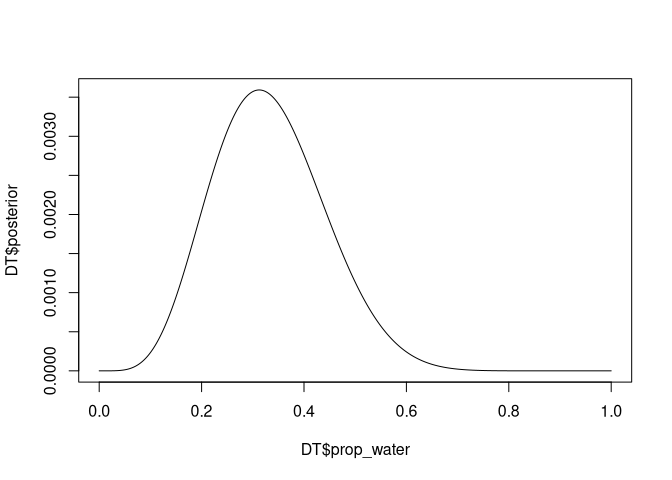
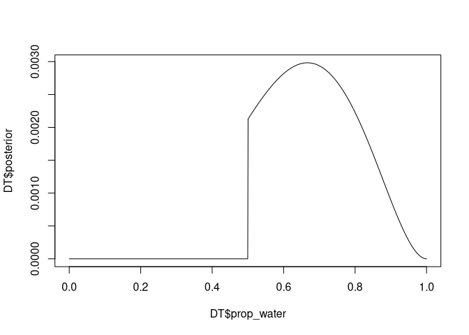

Homework Week 01
================
Alec L. Robitaille
2022-01-26

# Question 1

> Suppose the globe tossing data had turned out to be 4 water and 11
> land. Construct the posterior distribution, using grid approximation.
> Use the same flat prior as in the book.

``` r
# Packages --------------------------------------------------------------------
library(data.table)


# Process ---------------------------------------------------------------------
# Size of grid for grid approximation
gridsize <- 1000

# Prior grid
prior_grid <- seq(0, 1, length.out = gridsize)

# Prior probability (all 1)
prior_prob <- rep(1, gridsize)

# Data probability, using binomial distribution
water <- 4
land <- 11
data_prob <- dbinom(water, water + land, prob = prior_grid)

# Wrap as DT
DT <- data.table(prop_water = prior_grid,
                 prior_water = prior_prob,
                 prob_water = data_prob)

# Calculate the posterior numerator by multiplying prior and data probability
DT[, posterior_num := prior_water * prob_water]

# Standardize by sum of posterior numerator
DT[, posterior := posterior_num / sum(posterior_num)]


# Plot -------------------------------------------------------------------------
plot(DT$prop_water, DT$posterior, type = 'l')
```

<!-- -->

## Question 2

> Now suppose the data are 4 water and 2 land. Compute the posterior
> again, but this time use a prior that is zero below p = 0.5 and a
> constant above p = 0.5. This corresponds to prior information that a
> majority of the Earth’s surface is water.

``` r
# Process ---------------------------------------------------------------------
# Size of grid for grid approximation
gridsize <- 1000

# Prior grid
prior_grid <- seq(0, 1, length.out = gridsize)

# Prior probability (all 1)
prior_prob <- c(rep(0, gridsize / 2), rep(1, gridsize / 2))

# Data probability
#  given 4, using binomial distribution
water <- 4
land <- 2
data_prob <- dbinom(water, water + land, prob = prior_grid)

# Wrap as DT
DT <- data.table(prop_water = prior_grid,
                 prior_water = prior_prob,
                 prob_water = data_prob)

# Calculate the posterior numerator by multiplying prior and data probability
DT[, posterior_num := prior_water * prob_water]

# Standardize by sum of posterior numerator
DT[, posterior := posterior_num / sum(posterior_num)]


# Plot -------------------------------------------------------------------------
plot(DT$prop_water, DT$posterior, type = 'l')
```

<!-- -->
