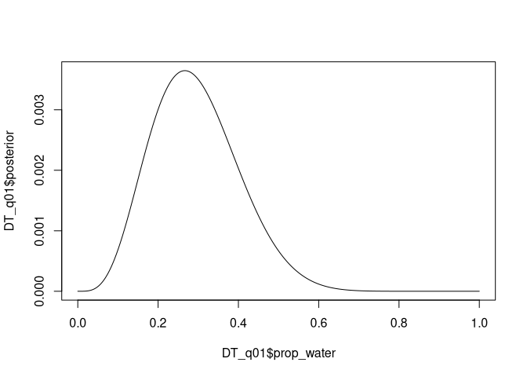
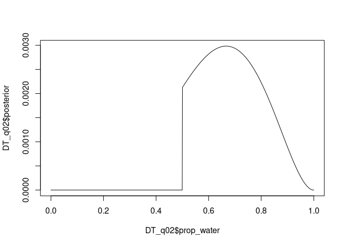
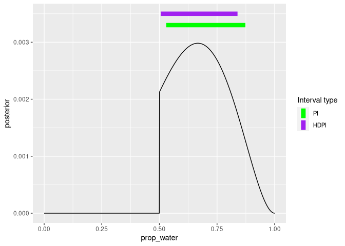

Homework Week 01
================
Alec L. Robitaille
2022-01-26

# Question 1

> Suppose the globe tossing data had turned out to be 4 water and 11
> land. Construct the posterior distribution, using grid approximation.
> Use the same flat prior as in the book.

``` r
# Packages --------------------------------------------------------------------
library(data.table)


# Process ---------------------------------------------------------------------
# Size of grid for grid approximation
gridsize <- 1000

# Prior grid
prior_grid <- seq(0, 1, length.out = gridsize)

# Prior probability (all 1)
prior_prob <- rep(1, gridsize)

# Data probability, using binomial distribution
water <- 4
land <- 11
data_prob <- dbinom(water, water + land, prob = prior_grid)

# Wrap as DT
DT_q01 <- data.table(prop_water = prior_grid,
                     prior_water = prior_prob,
                     prob_water = data_prob)

# Calculate the posterior numerator by multiplying prior and data probability
DT_q01[, posterior_num := prior_water * prob_water]

# Standardize by sum of posterior numerator
DT_q01[, posterior := posterior_num / sum(posterior_num)]


# Plot -------------------------------------------------------------------------
plot(DT_q01$prop_water, DT_q01$posterior, type = 'l')
```

<!-- -->

## Question 2

> Now suppose the data are 4 water and 2 land. Compute the posterior
> again, but this time use a prior that is zero below p = 0.5 and a
> constant above p = 0.5. This corresponds to prior information that a
> majority of the Earth’s surface is water.

``` r
# Process ---------------------------------------------------------------------
# Size of grid for grid approximation
gridsize <- 1000

# Prior grid
prior_grid <- seq(0, 1, length.out = gridsize)

# Prior probability (all 1)
prior_prob <- c(rep(0, gridsize / 2), rep(1, gridsize / 2))

# Data probability
#  given 4, using binomial distribution
water <- 4
land <- 2
data_prob <- dbinom(water, water + land, prob = prior_grid)

# Wrap as DT
DT_q02 <- data.table(prop_water = prior_grid,
                     prior_water = prior_prob,
                     prob_water = data_prob)

# Calculate the posterior numerator by multiplying prior and data probability
DT_q02[, posterior_num := prior_water * prob_water]

# Standardize by sum of posterior numerator
DT_q02[, posterior := posterior_num / sum(posterior_num)]


# Plot -------------------------------------------------------------------------
plot(DT_q02$prop_water, DT_q02$posterior, type = 'l')
```

<!-- -->

## Question 3

> For the posterior distribution from 2, compute 89% percentile and HPDI
> intervals. Compare the widths of these intervals. Which is wider? Why?
> If you had only the information in the interval, what might you
> misunderstand about the shape of the posterior distribution?

``` r
# Packages ---------------------------------------------------------------------
library(rethinking)
```

    ## Loading required package: rstan

    ## Loading required package: StanHeaders

    ## Loading required package: ggplot2

    ## rstan (Version 2.21.3, GitRev: 2e1f913d3ca3)

    ## For execution on a local, multicore CPU with excess RAM we recommend calling
    ## options(mc.cores = parallel::detectCores()).
    ## To avoid recompilation of unchanged Stan programs, we recommend calling
    ## rstan_options(auto_write = TRUE)

    ## Loading required package: cmdstanr

    ## This is cmdstanr version 0.4.0.9001

    ## - CmdStanR documentation and vignettes: mc-stan.org/cmdstanr

    ## - CmdStan path: /home/alecr/.cmdstan/cmdstan-2.27.0

    ## - CmdStan version: 2.27.0

    ## 
    ## A newer version of CmdStan is available. See ?install_cmdstan() to install it.
    ## To disable this check set option or environment variable CMDSTANR_NO_VER_CHECK=TRUE.

    ## Loading required package: parallel

    ## rethinking (Version 2.21)

    ## 
    ## Attaching package: 'rethinking'

    ## The following object is masked from 'package:rstan':
    ## 
    ##     stan

    ## The following object is masked from 'package:stats':
    ## 
    ##     rstudent

``` r
library(ggplot2)


# Samples ----------------------------------------------------------------------
# Sample from posterior
samples <- DT_q02[, sample(prop_water, size = gridsize, prob = posterior, replace = TRUE)]
mean(samples)
```

    ## [1] 0.6867237

``` r
PI(samples, 0.89)
```

    ##        5%       94% 
    ## 0.5295295 0.8729279

``` r
HPDI(samples, 0.89)
```

    ##     |0.89     0.89| 
    ## 0.5055055 0.8388388

``` r
DT_q03 <- data.table(rbind(t(PI(samples, 0.89)), t(HPDI(samples, 0.89))), c('PI', 'HDPI'))
setnames(DT_q03, c('low', 'high', 'type'))


# Plot -------------------------------------------------------------------------
ggplot() +
  geom_line(aes(prop_water, posterior), data = DT_q02) +
  geom_linerange(aes(xmin = low, xmax = high, y = 0.0033, color = 'PI'), 
                 size = 3, data = DT_q03[type == 'PI']) +
  geom_linerange(aes(xmin = low, xmax = high, y = 0.0035, color = 'HDPI'), 
                 size = 3, data = DT_q03[type == 'HDPI']) +
  scale_color_manual(values = list('PI' = 'green', 'HDPI' = 'purple'),
                     name = 'Interval type')
```

<!-- -->

-   PI: percentile intervals
-   HDPI: highest posterior density interval

Percentile intervals assign equal probability mass to each tail whereas
highest posterior density intervals return the interval with the highest
posterior probability.
