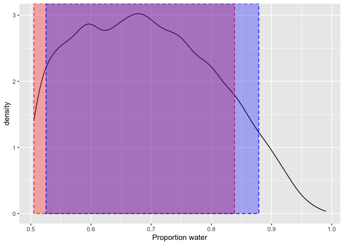

Statistical Rethinking homework wk 1
================
Levi Newediuk

``` r
library(tidyverse)
library(rethinking)
```

    ## Warning: package 'cmdstanr' was built under R version 4.0.5

### **Question 1** Suppose the globe tossing data (Chapter 2) had turned out to be 4 water and 11 land. Construct the posterior distribution, using grid approximation. Use the same flat prior as in the book.

``` r
# Define grid
p_grid <- seq(0, 1, length.out = 100)

# Define prior (flat, all = 1)
prior <- rep(1, 20)

# Compute likelihood of 4 water of 15 tosses (11 land) given p_grid
likelihood <- dbinom(4, 15, prob = p_grid)

# Compute product of likelihood and prior (posterior) and add to df with p_grid
probs_df <- data.frame(prob = p_grid,
                       prior,
                       post = likelihood * prior) %>%
  # Standardize the posterior
  mutate(std_post = post/sum(post))
```

``` r
# Plot the distribution of posterior probabilities for each parameter value (proportion water)

# Define function for plot
plot_posterior <- function(dat) {
  ggplot(dat, aes(x = p_grid, y = std_post)) +
    geom_point() +
    ylab('Posterior probability') +
    xlab('Proportion water')
}

# Plot
plot_posterior(probs_df)
```

<!-- -->

### **Question 2** Now suppose the data are 4 water and 2 land. Compute the posterior again, but this time use a prior that is zero below p = 0.5 and a constant above p = 0.5. This corresponds to prior information that a majority of the Earth’s surface is water.

``` r
# Set the new likelihood for 4 water in 6 tosses
likelihood_2 <- dbinom(4, 6, prob = p_grid)

probs_df_2 <- probs_df %>%
  # Set the new prior to 0 if < 0.5 else 1
  mutate(prior = ifelse(prob < 0.5, 0, 1),
         # Compute the new posterior
         post = likelihood_2 * prior,
         # Standardize the new posterior
         std_post = post / sum(post))

# Plot
plot_posterior(probs_df_2)
```

<!-- -->

### **Question 3** For the posterior distribution from 2, compute 89% percentile and HPDI intervals. Compare the widths of these intervals. Which is wider? Why? If you had only the information in the interval, what might you misunderstand about the shape of the posterior distribution?

``` r
# Draw 10,000 samples from the posterior
samples_2 <- sample(probs_df_2$prob, 
                    prob = probs_df_2$std_post, 
                    size = 10000, replace = T)

# Taking a quick look at the samples...
head(samples_2)
```

    ## [1] 0.8181818 0.7777778 0.5858586 0.9191919 0.5151515 0.7171717

``` r
# Calculate percentile intervals
samples_2_PI <- PI(samples_2, prob = 0.89)

# And HPDI
samples_2_HPDI <- HPDI(samples_2, prob = 0.89)
```

The percentile interval assigns the probability mass to the centre of
the distribution, i.e., 5.5% in each tail. It is wider because it places
the interval with respect to the centre of the distribution and not the
best representation of the data. Because the probability mass is pushed
to the centre, may miss the most probable parameter value. The HPDI
assigns the interval to the narrowest interval containing the
probability mass, so it better represents the data and more likely to
capture the most likely parameter value. The intervals are mostly
similar if the distribution is normal, but when it is skewed the HPDI is
a better representation of the data.

In the plot, the HPDI interval is shown in red and the percentile
interval in blue. The percentil interval is wider and potentially misses
values at the lower end because the distribution is skewed

``` r
# Plot a density distribution of the sample and the intervals
ggplot(data.frame(values = samples_2), aes(x = values)) +
  geom_density() +
  annotate('rect', 
           xmin = samples_2_HPDI[1], xmax = samples_2_HPDI[2], 
           ymin = 0, ymax = Inf, alpha = 0.3, 
           colour = 'red', fill = 'red', linetype = 'dashed') +
  annotate('rect', 
           xmin = samples_2_PI[1], xmax = samples_2_PI[2],
           ymin = 0, ymax = Inf, alpha = 0.3, 
           colour = 'blue', fill = 'blue', linetype = 'dashed') +
  xlab('Proportion water')
```

<!-- -->

### **Question 4** OPTIONALCHALLENGE. Suppose there is bias in sampling so that Land is more likely than Water to be recorded. Specifically, assume that 1-in-5 (20%) of Water samples are accidentally recorded instead as ”Land”. First, write a generative simulation of this sampling process. Assuming the true proportion of Water is 0.70, what proportion does your simulation tend to produce instead? Second, using a simulated sample of 20 tosses, compute the unbiased posterior distribution of the true proportion of water.

``` r
# Generate 10,000 samples for number of water samples of 9 when the proportion of water is 0.7, but there is only a 4/5 probability of recording a true water as water
unbiased_samp <- rbinom(10000, size = 9, prob = 0.7)
biased_samp <- rbinom(10000, size = 9, prob = 0.7 * 4/5)

# Biased sample distribution
table(biased_samp)
```

    ## biased_samp
    ##    0    1    2    3    4    5    6    7    8    9 
    ##    6   73  357 1059 2066 2614 2205 1203  368   49

``` r
# Unbiased sample distribution
table(unbiased_samp)
```

    ## unbiased_samp
    ##    1    2    3    4    5    6    7    8    9 
    ##    7   36  209  781 1697 2640 2716 1504  410

``` r
# Proportion of water produced by biased sample (as opposed to true proportion 0.7)
biased_prop <- mean(biased_samp) / 9

# Generate another 10,000 samples of 20 trials when sample is biased
biased_samp <- rbinom(10000, size = 20, prob = 0.7 * 4/5)

# Calculate likelihood without bias
likelihood <- dbinom(round(mean(biased_samp), 0), 20, prob = p_grid)

# Now accounting for bias
likelihood_b <- dbinom(round(mean(biased_samp), 0), 20, prob = p_grid * 4/5)

# Compute product of likelihood and prior (posterior) and add to df with p_grid
probs_df_4 <- data.frame(prob = p_grid,
                       prior,
                       post = likelihood * prior,
                       post_biased = likelihood_b * prior) %>%
  # Standardize the posterior
  mutate(unbiased = post / sum(post),
         biased = post_biased / sum(post_biased)) %>%
  pivot_longer(cols = c(unbiased, biased), 
               names_to = 'sample_type', 
               values_to = 'posterior')

# Plot
ggplot(probs_df_4, aes(x = prob, y = posterior, colour = sample_type)) +
  geom_point()
```

<!-- -->

Accounting for bias, the simulation tends to produce a proportion of \~
0.56. The unbiased posterior distribution seems to underestimate the
actual proportion of water. When accounting for the bias in the sample,
the posterior distribution is centred around the true proportion of
water.
