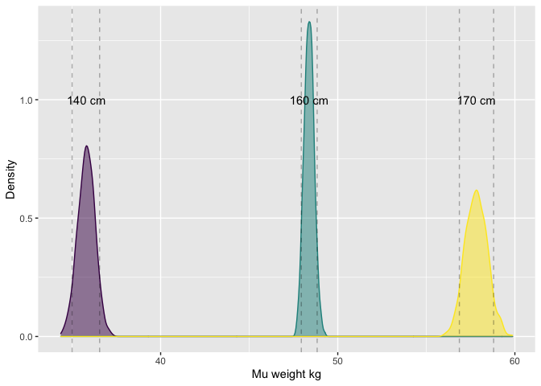

Statistical Rethinking homework wk 2
================
Levi Newediuk

### **Question 1** Construct a linear regression of weight as predicted by height, using the adults (age 18 or greater) from the Howell1 dataset. The heights listed below were recorded in the \!Kung census, but weights were not recorded for these individuals. Provide predicted weights and 89% compatibility intervals for each of these individuals. That is, fill in the table below, using model-based predictions.

``` r
library(tidyverse)
```

    ## Warning: package 'tidyr' was built under R version 4.0.5

``` r
library(rethinking)
```

    ## Warning: package 'cmdstanr' was built under R version 4.0.5

Load the data

``` r
data("Howell1")

# Filter only those > 18
dat_adult <- Howell1 %>%
  filter(age >= 18)
```

Now fitting the model for weight \~ height

``` r
# Mean of weights
xbar <- mean(dat_adult$height)

# Fit model
# (Define priors for three parameters a, b, and sigma)
model_adult <- quap (
  alist (
    weight ~ dnorm(mu, sigma), # Weight as normal density dist with mu, sigma
    mu <- a + b * (height - xbar), # Mean weight as f of slope & centred height
    a ~ dnorm(50, 20), # Normal prior for weight kg at mean height (intercept)
    b ~ dlnorm(0, 1), # Log-normal prior for slope wieght ~ height (keep pos.)
    sigma ~ dunif(0, 50) # Uniform prior for sigma
  ), data = dat_adult
)
```

Extract samples from the posterior distribution and get 89% CIs for
heights 140, 160, 175 cm

``` r
# Extract 1,000 samples from posterior
weight_post <- extract.samples(model_adult, n = 1000)

# Initiate loop
height_dists <- data.frame()
PIs <- data.frame()
for(i in c(140, 160, 175)) {
  # Get distribution of mu weight at desired height
  mu_at_height <- weight_post$a + weight_post$b * (i - xbar)
  height_dists <- rbind(height_dists, data.frame(height = i, mu_at_height))
  PIs <- rbind(PIs, data.frame(PI = PI(mu_at_height, prob = 0.89)))
}
```

Now plot the distributions of weights at each height with 89% CIs

``` r
ggplot(height_dists, aes(x = mu_at_height, col = factor(height), fill = factor(height))) +
  scale_colour_viridis_d() +
  scale_fill_viridis_d() +
  geom_density(alpha = 0.5) +
  annotate(geom = 'text', 
           x = c( 
             mean(height_dists[height_dists$height == 140 ,]$mu_at_height),
             mean(height_dists[height_dists$height == 160 ,]$mu_at_height),
             mean(height_dists[height_dists$height == 175 ,]$mu_at_height)),
           y = 1,
           label = c('140 cm', '160 cm', '170 cm')
  ) +
  theme(legend.position = 'none') +
  geom_vline(data = PIs, aes(xintercept = PI), linetype = 'dashed', alpha = 0.3) +
  ylab('Density') + xlab('Mu weight kg')
```

<!-- -->
