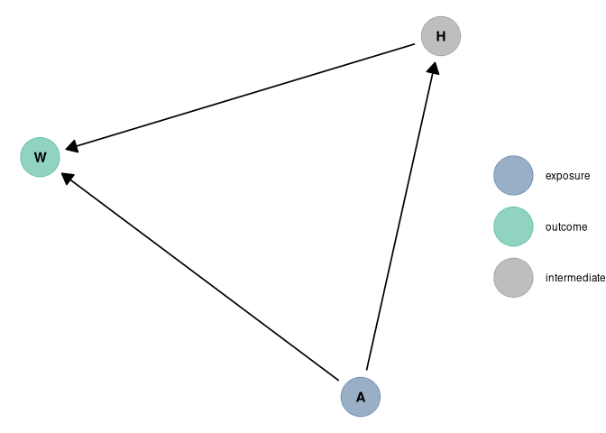

Homework Week 02
================
Alec L. Robitaille
2022-02-07

# Question 1

> Construct a linear regression of weight as predicted by height, using
> the adults (age 18 or greater) from the Howell1 dataset. The heights
> listed below were recorded in the !Kung census, but weights were not
> recorded for these individuals. Provide predicted weights and 89%
> compatibility intervals for each of these individuals. That is, fill
> in the table below, using model-based predictions.

<!-- -->

# Question 2

> From the Howell1 dataset, consider only the people younger than 13
> years old. Estimate the causal association between age and weight.
> Assume that age influences weight through two paths. First, age
> influences height, and height influences weight. Second, age directly
> influences weight through age- related changes in muscle growth and
> body proportions. All of this implies this causal model (DAG):

<!-- -->

    ## [1] "Variables to include to measure total effect of age on weight:"

    ##  {}

> Use a linear regression to estimate the total (not just direct) causal
> effect of each year of growth on weight. Be sure to carefully consider
> the priors. Try using prior predictive simulation to assess what they
> imply.

<!-- -->
