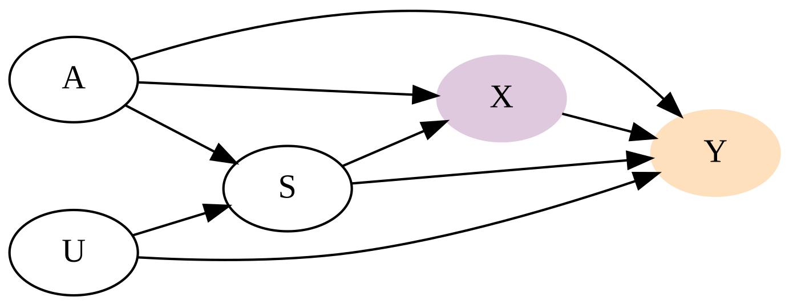

```{r}
#| include = FALSE
knitr::opts_knit$set(root.dir = '../.')
```

```{r}
#| include = FALSE
source('R/packages.R')
source('R/dag_plot.R')
source('R/plot_halfeye.R')

knitr::opts_chunk$set(
	echo = FALSE,
	fig.path = '../graphics/homework/'
)


theme_set(theme_bw(base_size = 16))
```

# Question 1

> The first two problems are based on the same data. The data in data(foxes) are
116 foxes from 30 different urban groups in England. These fox groups are like
street gangs. Group size (groupsize) varies from 2 to 8 individuals. Each group
maintains its own (almost exclusive) urban territory. Some territories are
larger than others. The area variable encodes this information. Some territories
also have more avgfood than others. And food influences the weight of each fox.
Assume this DAG:

```{r dag_h03_q01}
dag <- dagify(
    F ~ A,
    G ~ F,
    W ~ F + G, 
    exposure = 'A',
    outcome = 'F'
)
```

```{r}
dag_plot(dag, 'graphics/homework/dot_h03_q01')
```


> where F is avgfood, G is groupsize, A is area, and W is weight. Use the
backdoor criterion and estimate the total causal influence of A on F. What
effect would increasing the area of a territory have on the amount of food
inside it?

No backdoor paths into food, therefore only include area and food to measure 
the total causal influence of area on food.

Adjustment sets:
```{r h03_q01_adjust_sets, echo = TRUE}
adjustmentSets(dag, effect = 'total')
```

```{r h03_q01_halfeye_beta_area, fig.height = 4}
h03_q01_draws <- tar_read(h03_q01_draws_h03_q01)
plot_halfeye(h03_q01_draws, 'beta_area')
```

```{r h03_q01_food_predictions}
tar_read(plot_food_predictions)
```


# Question 2

> Now infer both the total and direct causal effects of adding food F to a
territory on the weight W of foxes. Which covariates do you need to adjust for
in each case? In light of your estimates from this problem and the previous one,
what do you think is going on with these foxes? Feel free to speculate— all that
matters is that you justify your speculation.

```{r dag_h03_q02}
dag <- dagify(
    F ~ A,
    G ~ F,
    W ~ F + G, 
    exposure = 'F',
    outcome = 'W'
)
```

```{r}
dag_plot(dag, 'graphics/homework/dot_h03_q02')
```


 


Adjustment sets (total effect):
```{r h03_q02_adjust_sets_total, echo = TRUE}
adjustmentSets(dag, effect = 'total')
```


Adjustment sets (direct effect):
```{r h03_q02_adjust_sets_direct, echo = TRUE}
adjustmentSets(dag, effect = 'direct')
```


```{r h03_q02_total_direct}
total_draws <- tar_read(h03_q02_draws_h03_q02_total)
direct_draws <- tar_read(h03_q02_draws_h03_q02_direct)

DT <- data.table(
  beta_food_total = total_draws$beta_food,
  beta_food_direct = direct_draws$beta_food,
  beta_groupsize = direct_draws$beta_groupsize
) |> melt(measure.vars = patterns('beta'))

ggplot(DT, aes(value, variable))  + 
  geom_vline(xintercept = 0) + 
  stat_halfeye() + 
  theme_bw()
```


# Question 3 

> Reconsider the Table 2 Fallacy example (from Lecture 6), this time with an
unobserved confound U that influences both smoking S and stroke Y. Here’s the
modified DAG:

```{r h03_q03_dag}
dag <- dagify(
  S ~ U + A,
  Y ~ S + U + X + A,
  X ~ S + A,
  exposure = 'X',
  outcome = 'Y'
)
```

```{r}
dag_plot(dag, 'graphics/homework/dot_h03_q03')
```




> First use the backdoor criterion to determine an adjustment set that allows
you to estimate the causal effect of X on Y, i.e. P(Y|do(X)). Second explain the
proper interpretation of each coefficient implied by the regression model that
corresponds to the adjustment set. Which coefficients (slopes) are causal and
which are not? There is no need to fit any models. Just think through the
implications.

Adjustment sets (direct effect):
```{r, echo = TRUE}
adjustmentSets(dag, effect = 'direct')
```

The paths from X to Y:

- X -> Y
- X <- S <- A -> Y
- X <- A -> Y

X has backdoor paths from S and A. S is a pipe between A and X. 
A is a fork between X and Y. To model the causal effect of X and Y, we need to
include A and S. The coefficients for A and S, however, are not causal and 
should not be presented or interpreted as such.

