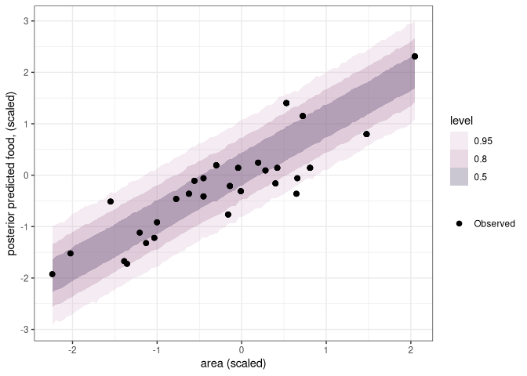

Homework Week 03
================
Alec L. Robitaille
2022-02-16

# Question 1

> The first two problems are based on the same data. The data in
> data(foxes) are 116 foxes from 30 different urban groups in England.
> These fox groups are like street gangs. Group size (groupsize) varies
> from 2 to 8 individuals. Each group maintains its own (almost
> exclusive) urban territory. Some territories are larger than others.
> The area variable encodes this information. Some territories also have
> more avgfood than others. And food influences the weight of each fox.
> Assume this DAG:

    ## [1] "graphics/homework/dot_h03_q01.png"


> where F is avgfood, G is groupsize, A is area, and W is weight. Use
> the backdoor criterion and estimate the total causal influence of A on
> F. What effect would increasing the area of a territory have on the
> amount of food inside it?

No backdoor paths into food, therefore only include area and food to
measure the total causal influence of area on food.

Adjustment sets:

``` r
adjustmentSets(dag, effect = 'total')
```

    ##  {}

<!-- -->

<!-- -->

# Question 2

> Now infer both the total and direct causal effects of adding food F to
> a territory on the weight W of foxes. Which covariates do you need to
> adjust for in each case? In light of your estimates from this problem
> and the previous one, what do you think is going on with these foxes?
> Feel free to speculate— all that matters is that you justify your
> speculation.

    ## [1] "graphics/homework/dot_h03_q02.png"


Adjustment sets (total effect):

``` r
adjustmentSets(dag, effect = 'total')
```

    ##  {}

Adjustment sets (direct effect):

``` r
adjustmentSets(dag, effect = 'direct')
```

    ## { G }

<!-- -->

# Question 3

> Reconsider the Table 2 Fallacy example (from Lecture 6), this time
> with an unobserved confound U that influences both smoking S and
> stroke Y. Here’s the modified DAG:

    ## [1] "graphics/homework/dot_h03_q03.png"


> First use the backdoor criterion to determine an adjustment set that
> allows you to estimate the causal effect of X on Y, i.e. P(Y\|do(X)).
> Second explain the proper interpretation of each coefficient implied
> by the regression model that corresponds to the adjustment set. Which
> coefficients (slopes) are causal and which are not? There is no need
> to fit any models. Just think through the implications.
