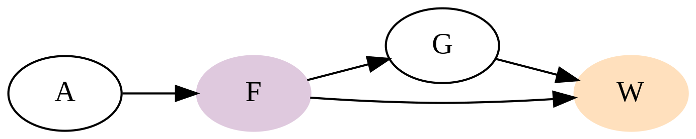

Homework Week 04
================
Alec L. Robitaille
2022-03-04

## Question 1

> Revisit the marriage, age, and happiness collider bias example from
> Chapter 6. Run models m6.9 and m6.10 again (pages 178–179). Compare
> these two models using both PSIS and WAIC. Which model is expected to
> make better predictions, according to these criteria? On the basis of
> the causal model, how should you interpret the parameter estimates
> from the model preferred by PSIS and WAIC?

Marriage is a collider between age and happiness. If we include marriage
as a predictor, it will generate an association between age and
happiness.

<!-- -->

    ## Model 1: Happiness ~ intercept[marriage index] + age

    ## 
    ## Computed from 4000 by 960 log-likelihood matrix
    ## 
    ##          Estimate   SE
    ## elpd_loo  -1356.9 18.6
    ## p_loo         3.6  0.2
    ## looic      2713.8 37.3
    ## ------
    ## Monte Carlo SE of elpd_loo is 0.0.
    ## 
    ## All Pareto k estimates are good (k < 0.5).
    ## See help('pareto-k-diagnostic') for details.

    ## Model 2: Happiness ~ intercept + age

    ## 
    ## Computed from 4000 by 960 log-likelihood matrix
    ## 
    ##          Estimate   SE
    ## elpd_loo  -1551.0 13.8
    ## p_loo         2.4  0.1
    ## looic      3102.0 27.6
    ## ------
    ## Monte Carlo SE of elpd_loo is 0.0.
    ## 
    ## All Pareto k estimates are good (k < 0.5).
    ## See help('pareto-k-diagnostic') for details.

    ## Compared

    ##        elpd_diff se_diff
    ## model1    0.0       0.0 
    ## model2 -194.1      17.6

The PSIS LOO results indicating that the model that includes marriage
has more predictive power, it does not indicate that the causal
structure or potential confounds are correctly accounted for in the
model. Marriage status is a collider, creating a statistical association
between age and happiness, and when removed from the model, there is no
longer an association between these variables.

    ## Model 1: Happiness ~ intercept[marriage index] + age

<!-- -->

    ## Model 2: Happiness ~ intercept + age

<!-- -->

See more details in `help('pareto-k-diagnostic')`.

## Question 2

> Reconsider the urban fox analysis from last week’s homework. On the
> basis of PSIS and WAIC scores, which combination of variables best
> predicts body weight (W, weight)? How would you interpret the
> estimates from the best scoring model?

    ##     elpd_diff se_diff elpd_loo se_elpd_loo p_loo  se_p_loo looic  se_looic
    ## fga    0.0       0.0  -161.4      7.8         4.5    0.8    322.8   15.5  
    ## fg    -0.4       1.7  -161.8      7.7         3.4    0.6    323.6   15.4  
    ## ga    -0.4       1.4  -161.8      7.6         3.5    0.6    323.6   15.1  
    ## f     -5.3       3.4  -166.7      6.7         2.3    0.3    333.4   13.4  
    ## a     -5.4       3.4  -166.8      6.7         2.5    0.4    333.6   13.3

The fitted models are compared using PSIS LOO and the comparison returns
the difference in ELPD (theoretical expected log pointwise predictive
density) from the model with the highest ELPD.

See more details in `help('loo-glossary')`.

Based on this, the model that includes all three predictors is slightly
better than the models with food and group size, and with area and group
size. This model has the highest predictive power, and we will use the
DAG to evaluate what the parameters returned by this model represent.

The parameter for group size represents the direct effect of group size
on weight. The parameter for food represents the direct causal effect of
food but since area is included in the model and, according to the DAG,
area causes food availability, then it is potentially impacted by area.
The indirect causal effect of food is not possible to estimate since
group size is included in the model. The parameter for area is
confounded by the inclusion of food since it is a mediator between area
and weight.

<!-- -->

# Question 3

> Adjusted Q3 for our colearning group: - Take a question/model from
> your own work, and draw the DAG. Try to think about unobserved
> variables in addition to things you did measure. - List the variables
> in your DAG and define them. What are the units? What is a reasonable
> range of values (using information from a different source than your
> own data)? - Define or justify the edges in your DAG. Just a sentence
> or two, but enough to clarify why you/literature/science/logic think
> this relationship exists.

<!-- -->
