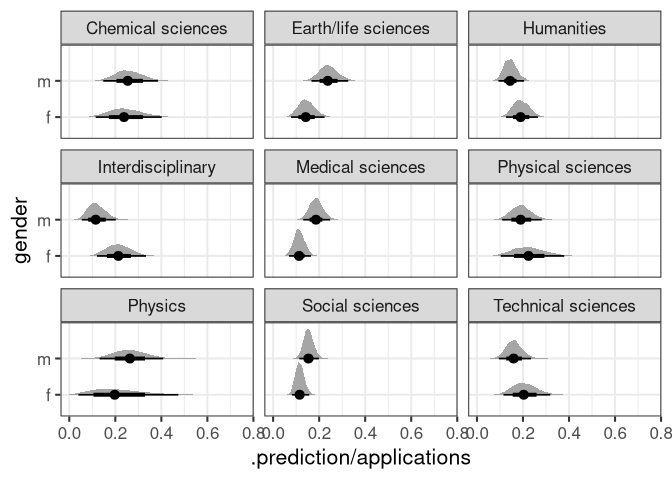
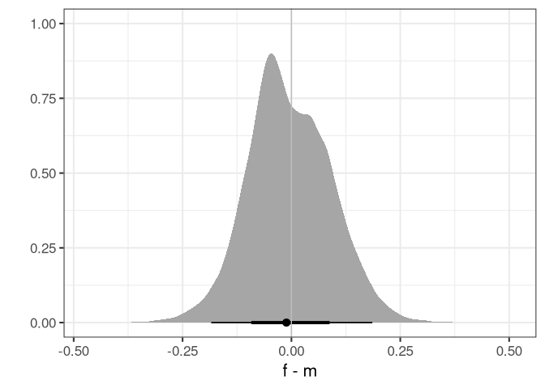

Homework Week 05
================
Alec L. Robitaille
2022-04-21

## Question 1

> The data in data(NWOGrants) are outcomes for scientific funding
> applications for the Netherlands Organization for Scientific Research
> (NWO) from 2010–2012 (see van der Lee and Ellemers
> <doi:10.1073/pnas.1510159112>). These data have a very similar
> structure to the UCBAdmit data discussed in Chapter 11. Draw a DAG for
> this sample and then use one or more binomial GLMs to estimate the
> TOTAL causal effect of gender on grant awards.

<!-- -->

    ## Setting all 'trials' variables to 1 by default if not specified otherwise.

<!-- -->

## Question 2

> Now estimate the DIRECT causal effect of gender on grant awards.
> Compute the average direct causal effect of gender, weighting each
> discipline in proportion to the number of applications in the sample.
> Refer to the marginal effect example in Lecture 9 for help.

    ## Setting all 'trials' variables to 1 by default if not specified otherwise.

<!-- -->

    ## Setting all 'trials' variables to 1 by default if not specified otherwise.

<!-- -->

    ## Setting all 'trials' variables to 1 by default if not specified otherwise.

<!-- --><!-- --><!-- -->

## Question 3

> Considering the total effect (problem 1) and direct effect (problem 2)
> of gender, what causes contribute to the average difference between
> women and men in award rate in this sample? It is not necessary to say
> whether or not there is evidence of discrimination. Simply explain how
> the direct effects you have estimated make sense (or not) of the total
> effect.

Above the horizontal line indicate higher proportion of men were
accepted, below the line indicates the reverse. The color of the point
indicates the discipline specific, proportion of female applications.

<!-- -->

<!-- 
## Question 4
4-OPTIONAL CHALLENGE. The data in data(UFClefties) are the outcomes
of 205 Ultimate Fighting Championship (UFC) matches (see ?UFClefties for de-
tails). It is widely believed that left-handed fighters (aka “Southpaws”) have an ad-
vantage against right-handed fighters, and left-handed men are indeed over-rep-
resented among fighters (and fencers and tennis players) compared to the general
population. Estimate the average advantage, if any, that a left-handed fighter has
against right-handed fighters. Based upon your estimate, why do you think left-
handers are over-represented among UFC fighters?
-->
