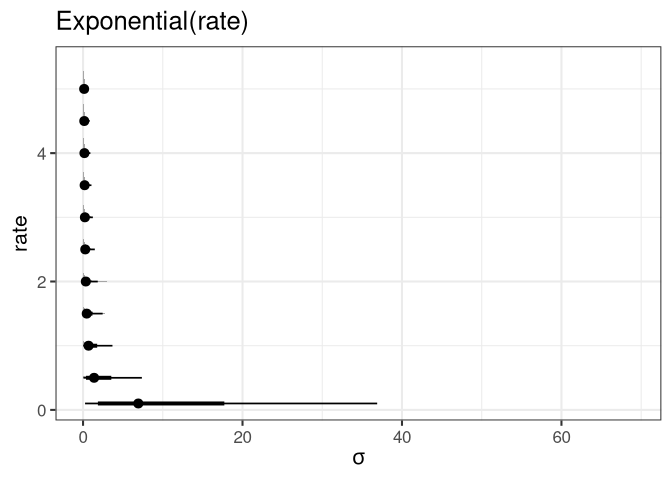
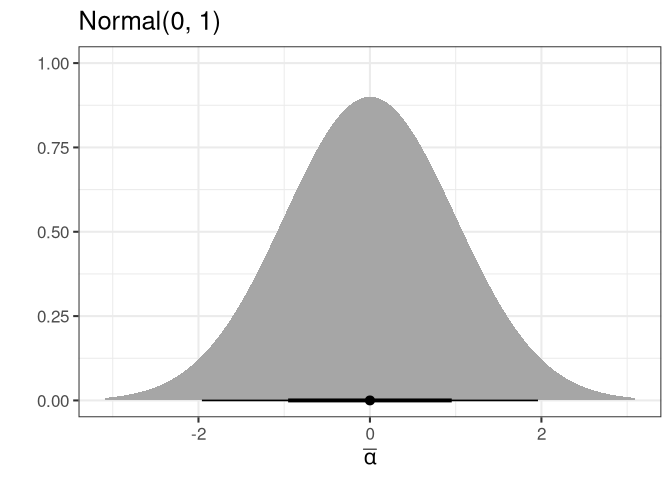
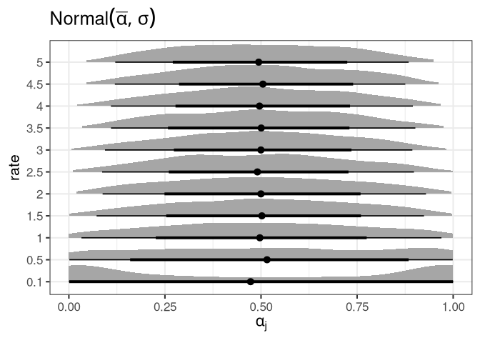

Homework Week 06
================
Alec L. Robitaille
2022-04-22

## Question 1

> Conduct a prior predictive simulation for the Reedfrog model. By this
> I mean to simulate the prior distribution of tank survival
> probabilities αj. Start by using this prior:

> αj ∼ Normal( ̄α, σ)

> ̄ α ∼ Normal(0, 1)

> σ ∼ Exponential(1)

> Be sure to transform the αj values to the probability scale for
> plotting and summary. How does increasing the width of the prior on σ
> change the prior distribution of αj? You might try Exponential(10) and
> Exponential(0.1) for example.

Note alpha j is shown on the probability scale.

    ## [[1]]

<!-- -->

    ## 
    ## [[2]]

<!-- -->

    ## 
    ## [[3]]

<!-- -->

## Question 2

> Revisit the Reedfrog survival data, data(reedfrogs). Start with the
> varying effects model from the book and lecture. Then modify it to
> estimate the causal effects of the treatment variables pred and size,
> including how size might modify the effect of predation. An easy
> approach is to estimate an effect for each combination of pred and
> size. Justify your model with a DAG of this experiment.

## Question 3

> Now estimate the causal effect of density on survival. Consider
> whether pred modifies the effect of density. There are several good
> ways to include density in your Binomial GLM. You could treat it as a
> continuous regression variable (possibly standardized). Or you could
> convert it to an ordered category (with three levels). Compare the σ
> (tank standard deviation) posterior distribution to σ from your model
> in Problem 2. How are they different? Why?
