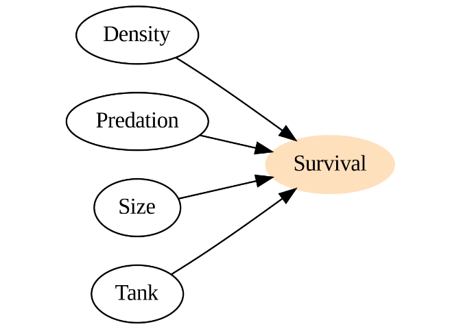
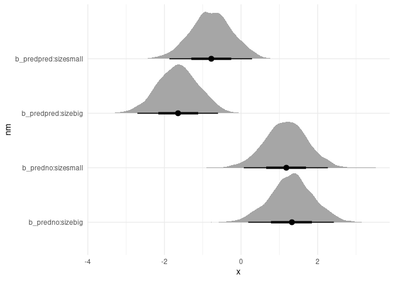
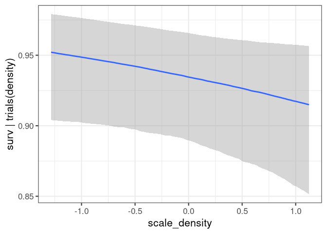
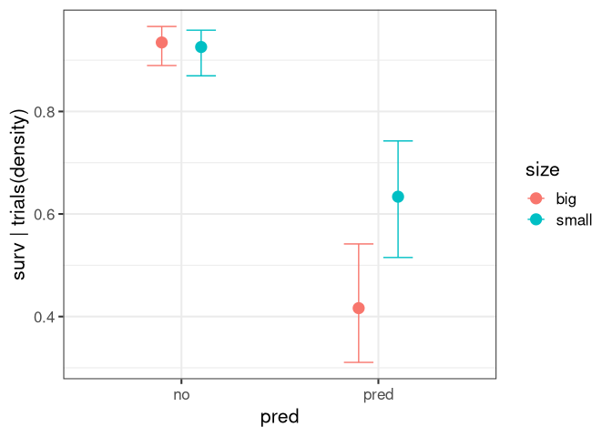

Homework Week 06
================
Alec L. Robitaille
2022-04-22

## Question 1

> Conduct a prior predictive simulation for the Reedfrog model. By this
> I mean to simulate the prior distribution of tank survival
> probabilities αj. Start by using this prior:

> αj ∼ Normal( ̄α, σ)

> ̄ α ∼ Normal(0, 1)

> σ ∼ Exponential(1)

> Be sure to transform the αj values to the probability scale for
> plotting and summary. How does increasing the width of the prior on σ
> change the prior distribution of αj? You might try Exponential(10) and
> Exponential(0.1) for example.

Note alpha j is shown on the probability scale.

    ## [[1]]

<!-- -->

    ## 
    ## [[2]]

<!-- -->

    ## 
    ## [[3]]

<!-- -->

## Question 2

> Revisit the Reedfrog survival data, data(reedfrogs). Start with the
> varying effects model from the book and lecture. Then modify it to
> estimate the causal effects of the treatment variables pred and size,
> including how size might modify the effect of predation. An easy
> approach is to estimate an effect for each combination of pred and
> size. Justify your model with a DAG of this experiment.

<!-- -->

    ##  Family: binomial 
    ##   Links: mu = logit 
    ## Formula: surv | trials(density) ~ pred:size + (1 | tank) 
    ##    Data: h06_q02_brms_data (Number of observations: 48) 
    ##   Draws: 4 chains, each with iter = 1000; warmup = 0; thin = 1;
    ##          total post-warmup draws = 4000
    ## 
    ## Priors: 
    ## b ~ normal(0, 1)
    ## Intercept ~ normal(0, 1.5)
    ## sd ~ exponential(1)
    ## 
    ## Group-Level Effects: 
    ## ~tank (Number of levels: 48) 
    ##               Estimate Est.Error l-95% CI u-95% CI Rhat Bulk_ESS Tail_ESS
    ## sd(Intercept)     0.74      0.15     0.49     1.06 1.00     1470     2477
    ## 
    ## Population-Level Effects: 
    ##                    Estimate Est.Error l-95% CI u-95% CI Rhat Bulk_ESS Tail_ESS
    ## Intercept              1.30      0.51     0.32     2.33 1.00     1398     1990
    ## predno:sizebig         1.32      0.56     0.19     2.42 1.00     1567     2287
    ## predpred:sizebig      -1.64      0.54    -2.71    -0.60 1.00     1413     2255
    ## predno:sizesmall       1.18      0.55     0.07     2.27 1.00     1631     2361
    ## predpred:sizesmall    -0.78      0.55    -1.87     0.29 1.00     1420     1743
    ## 
    ## Draws were sampled using sample(hmc). For each parameter, Bulk_ESS
    ## and Tail_ESS are effective sample size measures, and Rhat is the potential
    ## scale reduction factor on split chains (at convergence, Rhat = 1).

<!-- -->

## Question 3

> Now estimate the causal effect of density on survival. Consider
> whether pred modifies the effect of density. There are several good
> ways to include density in your Binomial GLM. You could treat it as a
> continuous regression variable (possibly standardized). Or you could
> convert it to an ordered category (with three levels). Compare the σ
> (tank standard deviation) posterior distribution to σ from your model
> in Problem 2. How are they different? Why?

    ##  Family: binomial 
    ##   Links: mu = logit 
    ## Formula: surv | trials(density) ~ pred:size + scale_density + (1 | tank) 
    ##    Data: h06_q03_brms_data (Number of observations: 48) 
    ##   Draws: 4 chains, each with iter = 1000; warmup = 0; thin = 1;
    ##          total post-warmup draws = 4000
    ## 
    ## Priors: 
    ## b ~ normal(0, 1)
    ## Intercept ~ normal(0, 1)
    ## sd ~ exponential(1)
    ## 
    ## Group-Level Effects: 
    ## ~tank (Number of levels: 48) 
    ##               Estimate Est.Error l-95% CI u-95% CI Rhat Bulk_ESS Tail_ESS
    ## sd(Intercept)     0.72      0.15     0.45     1.03 1.00     1430     2150
    ## 
    ## Population-Level Effects: 
    ##                    Estimate Est.Error l-95% CI u-95% CI Rhat Bulk_ESS Tail_ESS
    ## Intercept              1.33      0.52     0.34     2.34 1.00     1383     1919
    ## scale_density         -0.26      0.15    -0.56     0.04 1.00     1836     2336
    ## predno:sizebig         1.35      0.56     0.21     2.45 1.00     1570     2143
    ## predpred:sizebig      -1.66      0.53    -2.70    -0.61 1.00     1387     1802
    ## predno:sizesmall       1.19      0.56     0.09     2.29 1.00     1500     2258
    ## predpred:sizesmall    -0.78      0.54    -1.86     0.26 1.00     1401     1991
    ## 
    ## Draws were sampled using sample(hmc). For each parameter, Bulk_ESS
    ## and Tail_ESS are effective sample size measures, and Rhat is the potential
    ## scale reduction factor on split chains (at convergence, Rhat = 1).

    ## Setting all 'trials' variables to 1 by default if not specified otherwise.

<!-- -->

    ## Setting all 'trials' variables to 1 by default if not specified otherwise.

<!-- -->
