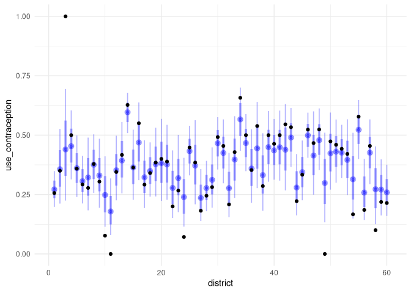
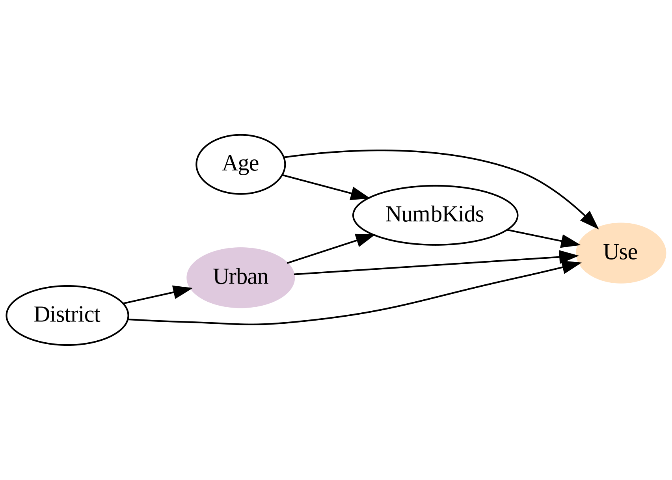
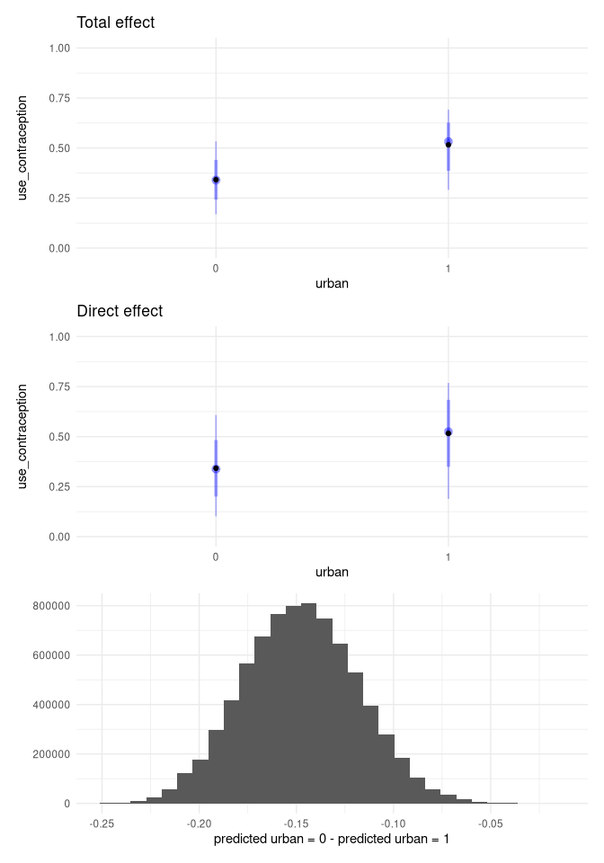

Homework Week 07
================
Alec L. Robitaille
2022-04-25

## Question 1

> The data in data(bangladesh) are 1934 women from the 1989 Bangladesh
> Fertility Survey. For each woman, we know which district she lived in,
> her number of living.children, her age.centered, whether she lived in
> an urban center, and finally whether or not she used contraception
> (use.contraception).

> In this first problem, I only want you to investigate the proportion
> of women using contraception in each district. Use partial pooling
> (varying effects). Then compare the varying effect estimates to the
> raw empirical proportion in each district. Explain the differences
> between the estimates and the data.

> Note that district number 54 is absent in the data. This causes some
> problems in indexing the parameters. The simplest fix is just to tell
> ulam manually how long the vector should be, like this: vector\[61\]:a
> \~ normal(abar,sigma). Pay special attention to district number 54’s
> estimate

<!-- -->

## Question 2

> First, draw a DAG that includes all five variables: (1) Uses
> contraception C (2) Age A (3) Children K (4) Urban U (5) District D.
> You don’t have to be an expert on fertility. But do think about which
> variables can influence which other variables. Second, design an
> estimation strategy to identify both the total and direct causal
> effects of living in an urban center on contraceptive use. Those are
> your estimands.

> Consider causal relationships among the variables. Then use your DAG
> to justify an adjustment set that will yield the estimate of the
> causal effect of urban living on contraceptive use.

> Do not run a statistical model (yet). I just want you to try to design
> an analysis. There is no firm right answer. Just apply the backdoor
> criterion and rules of d-separation (the elemental confounds)
> correctly to the DAG you design.

<!-- -->

    ## { District }

    ## { Age, District, NumbKids }

## Question 3

> Now build one or more statistical models to estimate the total and the
> direct causal effects of urban living on contraceptive use. Again
> include district as a simple varying effect (as in problem 1) so that
> each district has its own average contraceptive use. You may also want
> to stratify the effect of urban living by district. If you do, think
> carefully about how to do this statistically.

    ## `stat_bin()` using `bins = 30`. Pick better value with `binwidth`.

<!-- -->

<!--
4-OPTIONAL CHALLENGE. Can you also go beyond the parameter estimates
from problem 3 and compute a marginal causal effect of urban living for each dis-
trict, using a standard age distribution? Use any population age distribution you
like. The important thing is to project the estimates from the sample of each dis-
trict (which does not have representative age distributions) to the population. If
you think the different districts should have different age distributions, that would
be even more interesting.
-->
