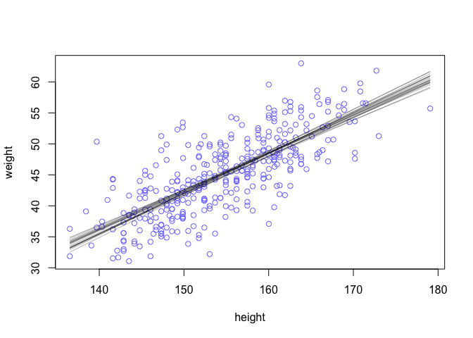
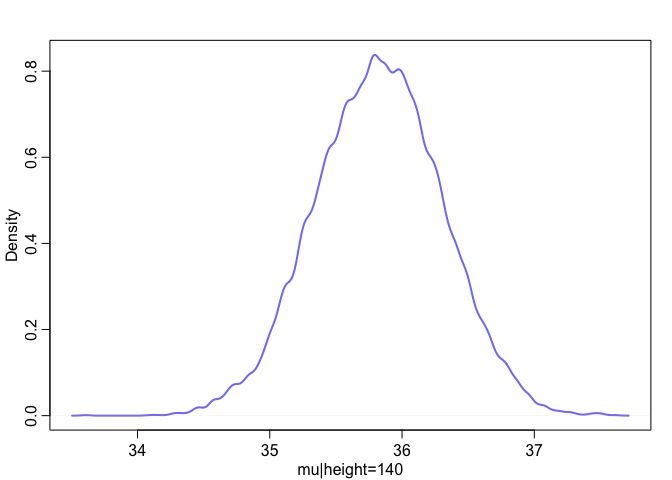
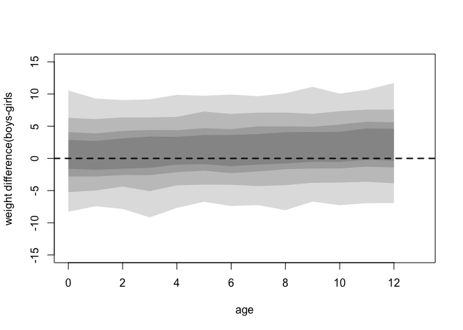

Week 2 Homework Linear Regressions
================
Jillian Kusch
05/02/2022

``` r
library(rethinking)
```

``` r
data(Howell1) #call data from rethinking package
data<-Howell1 #rename dataset for ease of coding
head(data) #look at first lines of data to check for correct import
```

    ##    height   weight age male
    ## 1 151.765 47.82561  63    1
    ## 2 139.700 36.48581  63    0
    ## 3 136.525 31.86484  65    0
    ## 4 156.845 53.04191  41    1
    ## 5 145.415 41.27687  51    0
    ## 6 163.830 62.99259  35    1

# Question 1:

## Provide predicted weights and 89% compatibility intervals for three adults based on given height

## Step 1: What is the goal?

The effect of height on weight in adults

## Step 2: Scientific Model

Height -> Weight  
Weight = f(Height)  
W = f(H)  

``` r
d18<-(data[data$age >= 18,]) #subset to adults 18 and older
plot(d18$weight~d18$height) #look at relationship that we are trying to model
```

<!-- -->

## Step 3: Statistical Model

Normal distribution of a basic Guassian model:  
h \~ Normal (mu, sigma) (likelihood)  
mu \~ Normal(mean value, standard deviation) (mu prior)  
sigma \~ Uniform(lower constraint of sigma, upper constraint of sigma)
(sigma prior)  

Normal distribution of a linear Guassian model:  
y\[i\] \~ Normal (mu\[i\], sigma) (likelihood)  
mu\[i\] = alpha + beta\*(x\[i\]) (linear model)  
alpha \~ Normal(mean value, standard deviation) (alpha prior)  
beta \~ Normal(lower slope relationship, upper slope relationship) (beta
prior)  
sigma \~ Uniform(lower constraint of sigma, upper constraint of sigma)
(sigma prior)  

Consider priors for the question at hand:  
What is a reasonable mean and standard deviation for adult weight
(alpha)?  
What is a reasonable/biologically logical slope (beta)?  
What is a reasonable/biologically logical range of standard deviation
(sigma)?  

``` r
xbar<-mean(d18$height) #define xbar

model<-quap( #quadratic approximation
  alist( #returns a list
    weight~dnorm(mu, sigma), #dnorm = normal distribution
    mu <-a+b*(height-xbar), #standardize to a reasonable intercept for average height
    a~dnorm(60, 10), #reasonable mean and sd of weight
    b~dlnorm(0,1), #log due to positive relationship only between variables
    sigma~dunif(0,10) #dunif = uniform distribution, reasonable sd of weight
  ) , data = d18
)

precis(model) # table of marginal distributions
```

    ##             mean         sd       5.5%      94.5%
    ## a     44.9981090 0.22538645 44.6378979 45.3583201
    ## b      0.6286965 0.02914518  0.5821168  0.6752761
    ## sigma  4.2296854 0.15941295  3.9749128  4.4844581

## Step 4: Check model for fit to data

``` r
###Plotting the data with 20 slopes from a sample of posteriors

post <- extract.samples(model , n=20 ) # extract 20 samples from the posterior

plot( d18$height , d18$weight , # plot raw data and sample size
      xlim=range(d18$height) , ylim=range(d18$weight) ,
      col=rangi2 , xlab="height" , ylab="weight" )

for ( i in 1:20 ) # plot the lines, with transparency
  curve( post$a[i] + post$b[i]*(x-xbar) ,
         col=col.alpha("black",0.3) , add=TRUE) #col.alpha function for transparency
```

<!-- -->

Good fitting values of mu of posterior predictions based on plot.

## Step 5: Estimate weights for 3 real individuals

This step requires the use of the ‘sim’ function as we want
compatability intervals that include uncertainty (sigma) unlike ‘link’
that just computes for mu.

``` r
#Simulation of estimated weights for actual heights (Model based predictions, not just link)
dat2<-list(height=c(140,160,175), xbar = xbar)
height_sim<-sim(model, data = dat2) #simulate data using posterior and Gaussian distribution
Est_weight<-apply(height_sim, 2, mean) #compute the mean of each column (dimension 2) of the height_sim matrix
height_CI <-apply(height_sim, 2, PI, prob = 0.89) #compute the percentile intervals of the matrix

results<-cbind(Height = c(140, 160, 175), Est_weight, Low89=height_CI[1,], Upper89=height_CI[2,])
print(results)
```

    ##      Height Est_weight    Low89  Upper89
    ## [1,]    140   35.47514 28.46478 42.16072
    ## [2,]    160   48.22025 41.38786 54.88840
    ## [3,]    175   58.09498 51.26161 64.94154

For comparison, calculating just mu mean and PI for a person that is 140
cm tall:

``` r
post<-extract.samples(model) #extracting samples of alpha, beta, sigma from posterior distribution, 10000 is default number to sample
mu_at_140<-post$a+post$b*(140-xbar) #vector of predicted means(mu) for each sample of the posterior 
dens( mu_at_140 , col=rangi2 , lwd=2 , xlab="mu|height=140" ) #plot of posterior distribution
```

<!-- -->

``` r
mean(mu_at_140)
```

    ## [1] 35.82297

``` r
PI(mu_at_140)
```

    ##       5%      94% 
    ## 35.06262 36.58748

# Question 2:

## Estimate the effect of age of weight for those under 13 years of age

## Step 1: What is the goal?

The total effect of age on weight in children

## Step 2: Scientific Model

Age -> Weight  
Weight = f(Age)  
W = f(A)  

``` r
d13<-data[data$age < 13,] #subset to younger than 13 years old
plot(d13$weight~d13$age) #plot to check 
```

<!-- -->

## Step 3: Statistical Model

Normal distribution of a linear Guassian model:  
y\[i\] \~ Normal (mu\[i\], sigma) (likelihood)  
mu\[i\] = alpha + beta\*(x\[i\]) (linear model)  
alpha \~ Normal(mean value, standard deviation) (alpha prior)  
beta \~ Normal(lower slope relationship, upper slope relationship) (beta
prior)  
sigma \~ Uniform(lower constraint of sigma, upper constraint of sigma)
(sigma prior)  

Consider priors for the question at hand:  
What is a reasonable mean and standard deviation for children’s weight
(alpha)?  
What is a reasonable/biologically logical slope (beta)?  
What is a reasonable/biologically logical range of standard deviation
(sigma)?  

Proposed model:

weight\~dnorm(mu, sigma), #dnorm = normal distribution  
mu \<-a+b\*age  
a\~dnorm(3.5, 1) -> mean weight at birth 3.5 kg with sd of 1 kg  
b\~dlnorm(0,1) -> log the beta value as only positive relationships  
sigma\~dexp(1) -> exponential distribution for parameters that must be
positive  

## Step 4: Simulation to assess priors

Create plot of simulated data based on priors for age and weight to
check that it makes sense biologically (i.e. not a negative
relationship)

``` r
set.seed(45)
N <- 100 # 100 lines
a <- rnorm( N , 3.5 , 1 ) #weight of baby at age 0
b <- rlnorm( N , 0 , 1 ) # log slope of growth 

plot( NULL , xlim=range(d13$age) , ylim=c(-50,100) ,
      xlab="age" , ylab="weight" )
abline( h=0 , lty=2 ) #minimum weight of baby
abline( h=60 , lty=1 , lwd=0.5 ) #weight of average adult
for ( i in 1:N ) curve( a[i] + b[i]*(x) ,
                        from=min(d13$age) , to=max(d13$age) , add=TRUE ,
                        col=col.alpha("black",0.2))
```

<!-- -->

## Step 5: Run model with validated priors

``` r
model<-quap( #quadratic approximation
  alist( #returns a list
    weight~dnorm(mu, sigma), #dnorm = normal distribution
    mu <-a+b*age,
    a~dnorm(3.5, 1),
    b~dlnorm(0,1), #dlnorm = log of normal distribution
    sigma~dexp(1) #dexp = exponential distribution
  ) , data = d13
)
precis(model) # table of marginal distributions
```

    ##           mean         sd     5.5%    94.5%
    ## a     7.004581 0.34269333 6.456891 7.552271
    ## b     1.395363 0.05277391 1.311020 1.479706
    ## sigma 2.515368 0.14663631 2.281014 2.749721

The range in mean mass at zero years is 6.46 - 7.55 kg, with a mean
increase of 1.31 - 1.48 kg per year until age 12.

# Question 3:

## Provide posteriot contrasts to show if boys and girls differ in growth rates from Q2.

## Step 1: What is the goal?

The total effect of age on weight for each sex

## Step 2: Scientific Model

Age*Sex -> Weight  
Weight = f(Age)*Sex  
W = f(A)\*S  

## Step 3: Statistical Model

Normal distribution of a linear Guassian model:  
y\[i\] \~ Normal (mu\[i\], sigma) (likelihood)  
mu\[i\] = alpha\[S\] + beta\[S\]\*(x\[i\]) (linear model with index
variable included)  
alpha \~ Normal(mean value, standard deviation) (alpha prior)  
beta \~ Normal(lower slope relationship, upper slope relationship) (beta
prior)  
sigma \~ Uniform(lower constraint of sigma, upper constraint of sigma)
(sigma prior)  

Used the same model and priors as in Q2, but included sex as an index
variable

``` r
d13$S<- d13$male+1#Create an index variable for sex

model<-quap( #quadratic approximation
  alist( #returns a list
    weight~dnorm(mu, sigma), #dnorm = normal distribution
    mu <-a[S]+b[S]*age, #did not rescale because we are interested in growth from 0
    a[S]~dnorm(3.5, 1),
    b[S]~dlnorm(0,1),#log the beta value to get a better estimation of the prior
    sigma~dexp(1)#dexp = exponential distribution for parameters that must be positive
  ) , data = d13
)
```

A plot to show the model regression (showing the difference in means):

``` r
#plot of slope values of age on weight for each sex (using mu via link function)
plot(d13$age, d13$weight, lwd = 3,col = ifelse(d13$male==1, 3, 2),
       xlab = "Age (years)", ylab = "Weight (kg)")
legend(1, 30, legend=c("Boys", "Girls"),
       col=c(3, 2), lty=1:1, cex=1,
       box.lty=0)
Aseq <-0:12

muF<-link(model, data = list(age=Aseq, S=rep(1,13)))   # generating mu values from the posterior 
                                      #distribution for each age of girls instead of by individual
shade(apply(muF,2,PI, 0.99), Aseq, col = col.alpha(2, 0.5))   #apply function of PI to matrix muF 
                                                              #of each column (dimension 2)
lines(Aseq, apply(muF, 2, mean), lwd = 3, col = 2) # apply function of mean to matrix muF

muM<-link(model, data = list(age=Aseq, S = rep(2, 13)))
shade(apply(muM, 2, PI, 0.99), Aseq, col = col.alpha(3, 0.5))
lines(Aseq, apply(muM, 2, mean), lwd = 3, col = 3)
```

<!-- -->

With the plotted regression from the model, we can see a small
difference between sexes, but generating a posterior contrast (mean
difference) will show this better.

## Step 4: Use simulations to generate posterior contrast for the difference between boys and girls

We want to include uncertainty of sigma as well, so we need to use the
‘sim’ function. (We are not generating the difference in posterior means
(mu)only).

``` r
Aseq<-0:12
mu1<-sim(model, data=list(age=Aseq, S=rep(1,13))) #simulate data from uncertainty in posterior for girls
mu2<-sim(model, data=list(age=Aseq, S=rep(2,13))) #simulate data from uncertainty in posterior for boys
mu_contrast<-mu1
for(i in 1:13) mu_contrast[,i] <- mu2[,i] - mu1[,i] #compute contrast at each age

plot(NULL, xlim = c(0, 13), ylim=c(-15,15),xlab = "age", ylab = "weight difference(boys-girls")
for(p in c(0.5, 0.67, 0.89, 0.99))
  shade(apply(mu_contrast,2,PI,prob=p), Aseq) #plot posterior contrast for multiple intervals
abline(h=0, lty=2,lwd=2)
```

<

qq!-- -->

The plot shows that boys are heavier than girls, especially as they age
up.
