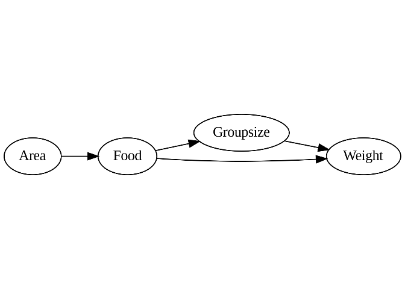
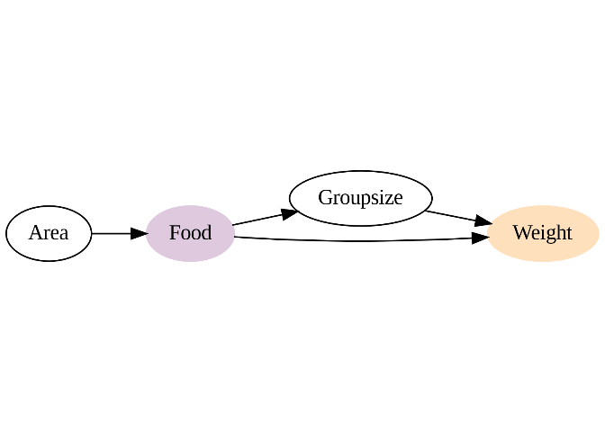
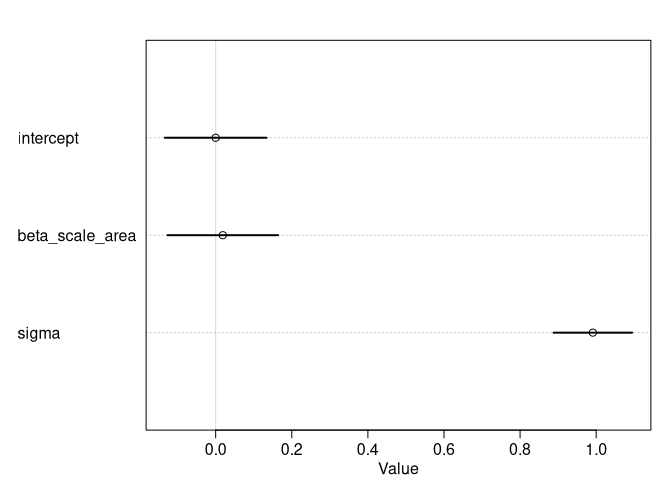
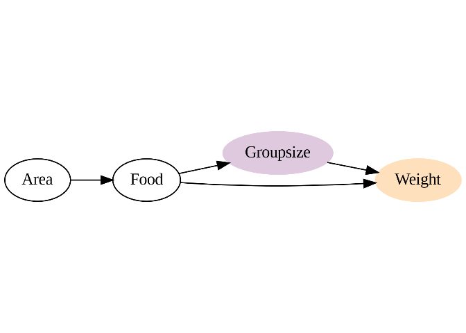
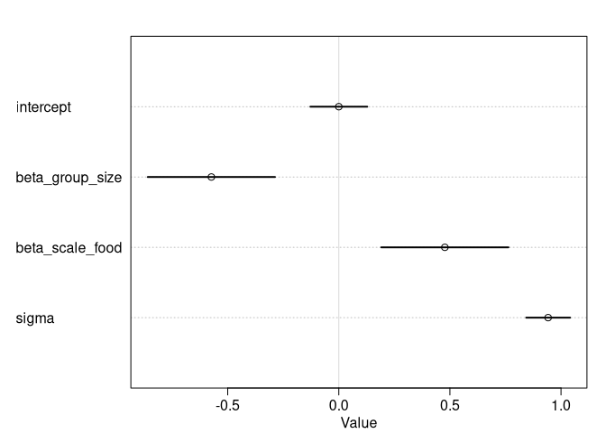
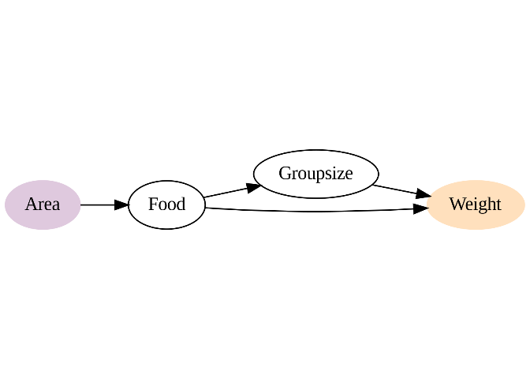
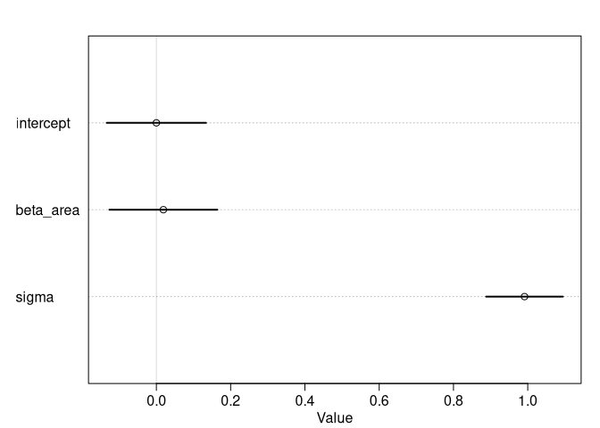

# Separate causal models

## Setup

``` r
library(rethinking)

data(foxes)

dag <- dagify(
    Food ~ Area,
    Groupsize ~ Food,
    Weight ~ Food + Groupsize
)
dag_plot(dag, 'graphics/example-foxes')
```

<!-- -->

``` r
DT <- data_foxes(scale = TRUE)
```

    ## Scaling numeric variables: avgfood, groupsize, area, weight

## Causal influence of food on weight

``` r
dag_food <- dagify(
    Food ~ Area,
    Groupsize ~ Food,
    Weight ~ Food + Groupsize,
    exposure = 'Food',
    outcome = 'Weight'
)
dag_plot(dag_food, 'graphics/example-foxes-food')
```

<!-- -->

``` r
adjustmentSets(dag_food, effect = 'total')
```

    ##  {}

``` r
m_food <- quap(alist(
  scale_weight ~ dnorm(mu , sigma),
  mu <- intercept + beta_scale_area * scale_area,
  intercept ~ dnorm(0, 0.2),
  beta_scale_area ~ dnorm(0, 0.5),
  sigma ~ dexp(1)
),
data = DT)
plot(precis(m_food))
```

<!-- -->

## Causal influence of group size on weight

``` r
dag_groupsize <- dagify(
    Food ~ Area,
    Groupsize ~ Food,
    Weight ~ Food + Groupsize,
    exposure = 'Groupsize',
    outcome = 'Weight'
)
dag_plot(dag_groupsize, 'graphics/example-foxes-groupsize')
```

<!-- -->

``` r
adjustmentSets(dag_groupsize, effect = 'total')
```

    ## { Food }

``` r
m_groupsize <- quap(alist(
  scale_weight ~ dnorm(mu , sigma),
  mu <- intercept + beta_group_size * scale_groupsize + beta_scale_food * scale_food,
  intercept ~ dnorm(0, 0.2),
  beta_group_size ~ dnorm(0, 0.5),
  beta_scale_food ~ dnorm(0, 0.5),
  sigma ~ dexp(1)
),
data = DT)
plot(precis(m_groupsize))
```

<!-- -->

## Causal influence of area on weight

``` r
dag_area <- dagify(
    Food ~ Area,
    Groupsize ~ Food,
    Weight ~ Food + Groupsize,
    exposure = 'Area',
    outcome = 'Weight'
)
dag_plot(dag_area, 'graphics/example-foxes-area')
```

<!-- -->

``` r
adjustmentSets(dag_area, effect = 'total')
```

    ##  {}

``` r
m_area <- quap(alist(
  scale_weight ~ dnorm(mu , sigma),
  mu <- intercept + beta_area * scale_area,
  intercept ~ dnorm(0, 0.2),
  beta_area ~ dnorm(0, 0.5),
  sigma ~ dexp(1)
),
data = DT)
plot(precis(m_area))
```

<!-- -->
