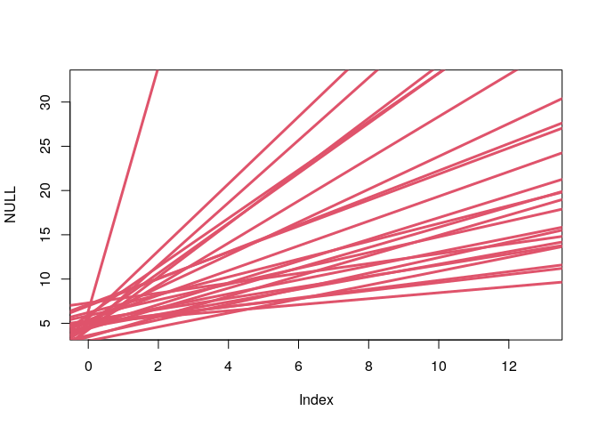

## Homework Week 2

Set up libraries and dataframes

``` r
suppressMessages(library(rethinking))
suppressMessages(library(dplyr))
data(Howell1)
d <- Howell1
d2 <- d[Howell1$age >= 18, ]
```

**Question 1:** Construct a linear regression of weight as predicted by
height, using the adults (age 18 or greater) from the Howell1 dataset.
The heights listed below were recorded in the !Kung census, but weights
were not recorded for these individuals. Provide predicted weights and
89% compatibility intervals for each of these individuals. That is, fill
in the table below, using model-based predictions.

``` r
# priors
set.seed(2971) # setting seed so it is reproducible 
N <- 100 # 100 lines
a <- rnorm( N , 178 , 20 ) # use mean height from different pop.
b <- rlnorm( 1e4 , 0 ,1) # beta to log normal - restrict to positive values
xbar <- mean(d2$height)

# model
m <- quap(
  alist(
    weight ~ dnorm( mu , sigma ) ,
    mu <- a + b*( height - xbar ) ,
    a ~ dnorm( 60 , 20 ) ,
    b ~ dlnorm( 0 , 1 ) ,
    sigma ~ dunif( 0 , 50 )
  ) , data=d2 )

# simulate weight 
sim.weight <- as.data.frame(sim(m , data=list(height= c(140, 160, 175), Hbar = xbar)))
weight.PI <- as.data.frame(apply( sim.weight , 2 , PI , prob=0.89 )) # get 89% PIs across simulated weights
```

| individual | height | expected weight | 89% interval    |
|-----------:|-------:|----------------:|:----------------|
|          1 |    140 |          35.942 | 29.228 - 42.807 |
|          2 |    160 |          48.271 | 41.715 - 55.24  |
|          3 |    175 |          57.409 | 50.22 - 64.212  |

**Question 2:** From the Howell1 dataset, consider only the people
younger than 13 years old. Estimate the causal association between age
and weight. Assume that age influences weight through two paths. First,
age influences height, and height influences weight. Second, age
directly influences weight through age-related changes in muscle growth
and body proportions. Use a linear regression to estimate the total (not
just direct) causal effect of each year of growth on weight. Be sure to
carefully consider the priors. Try using prior predictive simulation to
assess what they imply.

``` r
suppressMessages(library(rethinking))
d3 <- d[Howell1$age <= 13, ]
# age influences weight through a direct effect and indirect effect through height 
# total effect does not include height in model
m2 <- quap(
  alist(
    weight ~ dnorm( mu , sigma ) ,
    mu <- a + bA*age ,
    a ~ dnorm( 5 , 1 ) ,
    bA ~ dlnorm( 0 , 1 ) , # only positive values for age and height
    sigma ~ dexp(1) # exponential positive growth
  ) , data = d3 )

precis(m2)
```

    ##           mean         sd     5.5%    94.5%
    ## a     7.213024 0.33282988 6.681097 7.744950
    ## bA    1.362618 0.04681619 1.287796 1.437439
    ## sigma 2.528086 0.14140545 2.302093 2.754079

``` r
# do a prior predictive simulation to test prior performance
n <- 25
sample_mu <- rnorm( n , 5 , 1 )
sample_bA <- rlnorm(n, 0, 1)
plot( NULL , xlim=range(d3$age) , ylim=range(d3$weight) )
for ( i in 1:n ) abline( sample_mu[i] , sample_bA[i] , lwd=3 , col=2 )
```

<!-- -->

**Question 3:** Now suppose the causal association between age and
weight might be different for boys and girls. Use a single linear
regression, with a categorical variable for sex, to estimate the total
causal effect of age on weight separately for boys and girls. How do
girls and boys differ? Provide one or more posterior contrasts as a
summary.

**Question 4:** The data in data(Oxboys) (rethinking package) are growth
records for 26 boys measured over 9 periods. I want you to model their
growth. Specifically, model the increments in growth from one period
(Occasion in the data table) to the next. Each increment is simply the
difference between height in one occasion and height in the previous
occasion. Since none of these boys shrunk during the study, all of the
growth increments are greater than zero. Estimate the posterior
distribution of these increments. Constrain the distribution so it is
always positive—it should not be possible for the model to think that
boys can shrink from year to year. Finally compute the posterior
distribution of the total growth over all 9 occasions.
