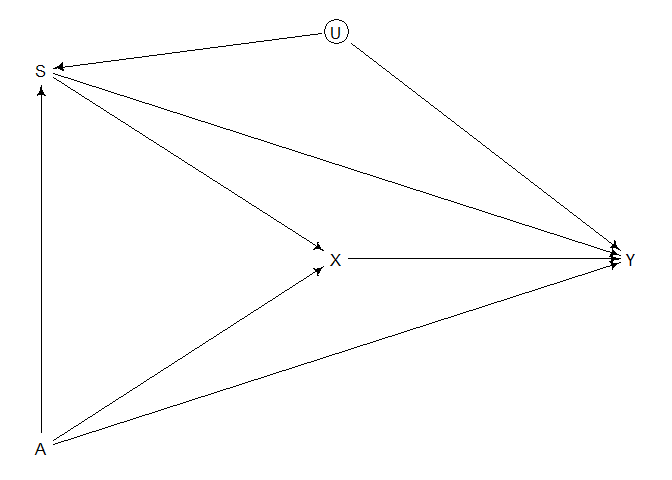

## Homework Week 3

**Question 1:** The first two problems are based on the same data. The
data in `data (foxes)` are 116 foxes from 30 different urban groups in
England. These fox groups are like street gangs. Group size
(`groupsize`) varies from 2 to 8 individuals. Each group maintains its
own (almost exclusive) urban territory. Some territories are larger than
others. The `area` variable encodes this information. Some territories
also have more `avgfood` than others. And food influences the `weight`
of each fox, where F is `avgfood`, G is `groupsize`, A is `area`, and W
is `weight` . Use the backdoor criterion and estimate the total causal
influence of A on F. What effect would increasing the area of a
territory have on the amount of food inside it?

<!-- -->

Start off by identifying backdoor pathways and the potential adjustments
that need to be made to the model to close backdoor paths:

``` r
dag1 <- dagitty("dag {
                A -> F 
                F -> G -> W 
                F -> W }")
adjustmentSets(dag1, exposure = "A", outcome = "F", effect = "total")
```

    ##  {}

There are no backdoor pathways of A -&gt; F (as seen in the DAG). So
building a model with F as a function of A is sufficient:

``` r
# standardize variables 
d$F <- standardize(d$avgfood)
d$A <- standardize(d$area)
# model
m1 <- quap(
  alist(
    F ~ dnorm(mu, sigma),
    mu <- a + bA*A,
    a ~ dnorm(0,0.2),
    bA ~ dlnorm(0,0.5), # area can only be positive so constrain to log normal
    sigma ~ dexp(1) 
  ), data = d
)

precis(m1)
```

    ##               mean         sd        5.5%      94.5%
    ## a     9.204647e-09 0.04230758 -0.06761568 0.06761569
    ## bA    8.820347e-01 0.04329142  0.81284667 0.95122278
    ## sigma 4.662172e-01 0.03051642  0.41744604 0.51498832

<!-- -->

The model output suggests that increasing the area territory would
increase the amount of food available.

**Question 2:** Now infer both the total and direct causal effects of
adding food F to a territory on the weight W of foxes. Which covariates
do you need to adjust for in each case? In light of your estimates from
this problem and the previous one, what do you think is going on with
these foxes? Feel free to speculate - all that matters is that you
justify your speculation.

Total causal effects of F on W:

``` r
# standardize variables 
d$F <- standardize(d$avgfood)
d$W <- standardize(d$weight)
# model total effects
m2t <- quap(
  alist(
    W ~ dnorm(mu, sigma),
    mu <- a + bF*F,
    a ~ dnorm(0,0.2),
    bF ~ dnorm(0,0.5), 
    sigma ~ dexp(1) 
  ), data = d
)

precis(m2t)
```

    ##                mean         sd       5.5%     94.5%
    ## a     -3.701509e-07 0.08360662 -0.1336199 0.1336192
    ## bF    -2.423889e-02 0.09089323 -0.1695038 0.1210261
    ## sigma  9.912366e-01 0.06467366  0.8878756 1.0945976

<!-- -->

Total causal model indicates that there is no relationship between
average food and weight of foxes.

To assess the direct causal effects of food on weight, we need to
stratify by group size (G) because it is currently an open backdoor path
(pipe). Let’s confirm using `dagitty`:

``` r
adjustmentSets(dag1, exposure = "F", outcome = "W", effect = "direct")
```

    ## { G }

Add G to the model:

``` r
# standardize variables 
d$F <- standardize(d$avgfood)
d$W <- standardize(d$weight)
d$G <- standardize(d$groupsize)

# model total effects
m2d <- quap(
  alist(
    W ~ dnorm(mu, sigma),
    mu <- a + bF*F + bG*G,
    a ~ dnorm(0,0.2),
    bF ~ dnorm(0,0.5),
    bG ~ dnorm(0, 0.5), 
    sigma ~ dexp(1) 
  ), data = d
)

precis(m2d)
```

    ##                mean         sd       5.5%      94.5%
    ## a      2.600825e-06 0.08013841 -0.1280741  0.1280793
    ## bF     4.772265e-01 0.17912417  0.1909515  0.7635015
    ## bG    -5.735014e-01 0.17914264 -0.8598059 -0.2871969
    ## sigma  9.420487e-01 0.06175333  0.8433549  1.0407424

The direct effect of food on weight is positive. Group size has an equal
magnitude of effect in the opposite direction. These two effects cancel
each other - which explains why the total effect of food is negligible:
direct effect is positive but mediated effect through group size is
negative/cancelled out.

Food influences group size, which mediates the influence of food on
weight. More foxes are present when more food is present, so foxes get
the same amount of food and their weight does not change.

**Question 3:** Reconsider the Table 2 Fallacy example (from Lecture 6),
this time with an unobserved confound U that influences both smoking S
and stroke Y. Here’s the modified DAG:

<!-- -->

First use the backdoor criterion to determine an adjustment set that
allows you to estimate the causal effect of X on Y, i.e. P(Y\|do(X)).
Second explain the proper interpretation of each coefficient implied by
the regression model that corresponds to the adjustment set. Which
coefficients (slopes) are causal and which are not? There is no need to
fit any models. Just think through the implications.

Currently, there are several backdoors open:

U -&gt; S -&gt; X -&gt; Y  
A -&gt; S -&gt; X -&gt; Y  
A -&gt; X -&gt; Y

Based on this, I think we should stratify by A to close one set of
backdoors. Additionally, stratifying by S could close the backdoor
through X, however, it is a collider between A and U and so stratifying
by S would open that pathway and create collider bias. So, I would only
stratify by A.

**CORRECTION:** collider bias does not influence our estimate of X-&gt;
Y because collider is between A -&gt; S &lt;- U and U does not introduce
an arrow into X so we can stratify by both!

Dagitty confirms that stratifying by A and S is required to estimate the
direct effect of X on Y:

``` r
adjustmentSets(dag2, exposure = "X", outcome = "Y", effect = "direct")
```

    ## { A, S }

In terms of which coefficients are causal and which are not:

X is a causal effect. Other coefficients are now biased by U.
Stratifying by S opens collider bias and A and S are not causal effects
because they are biased. Need explicit causal models to interpret
control coefficients.

**Question 4-OPTIONAL CHALLENGE:** Write a synthetic data simulation for
the causal model shown in Problem 3. Be sure to include the unobserved
confound in the simulation. Choose any functional relationships that you
like—you don’t have to get the epidemiology correct. You just need to
honor the causal structure. Then design a regression model to estimate
the influence of X on Y and use it on your synthetic data. How large of
a sample do you need to reliably estimate P(Y\|do(X))? Define “reliably”
as you like, but justify your definition.

``` r
f <- function(N = 200, bX = 0){ 
  U <- rnorm(N)
  A <- rnorm(N)
  S <- rnorm(N, A + U)
  X <- rnorm(N, A + S)
  Y <- rnorm(N, A + S + bX*X + U)
  return(
    list(
      A = standardize(A), S=standardize(S), X=standardize(X), Y=standardize(Y)))
}

sim_dat <- f(N=10, bX=0)

m4 <- quap(
  alist(
    Y ~ dnorm(mu, exp(log_sigma)), 
    mu <- a + bX*X + bA*A + bS*S,
    a ~ dnorm(0, 0.2),
    c(bX, bA, bS) ~ dnorm(0, 0.5), 
    log_sigma ~ dnorm(0,1)
  ), data = sim_dat
)

precis(m4)
```

    ##                    mean         sd       5.5%      94.5%
    ## a         -1.525719e-08 0.07242130 -0.1157432  0.1157432
    ## bX        -3.249924e-02 0.13750894 -0.2522651  0.1872666
    ## bA         3.783328e-01 0.08270684  0.2461513  0.5105143
    ## bS         8.682213e-01 0.13703938  0.6492059  1.0872367
    ## log_sigma -1.403686e+00 0.24134603 -1.7894041 -1.0179689
