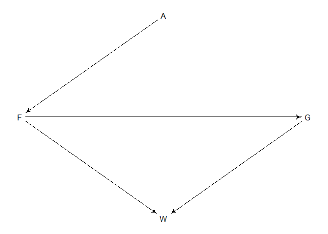

## Homework Week 3

**Question 1:** The first two problems are based on the same data. The
data in `data (foxes)` are 116 foxes from 30 different urban groups in
England. These fox groups are like street gangs. Group size
(`groupsize`) varies from 2 to 8 individuals. Each group maintains its
own (almost exclusive) urban territory. Some territories are larger than
others. The `area` variable encodes this information. Some territories
also have more `avgfood` than others. And food influences the `weight`
of each fox, where F is `avgfood`, G is `groupsize`, A is `area`, and W
is `weight` . Use the backdoor criterion and estimate the total causal
influence of A on F. What effect would increasing the area of a
territory have on the amount of food inside it?

<!-- -->

Start off by identifying backdoor pathways and the potential adjustments
that need to be made to the model to close backdoor paths.

``` r
dag1 <- dagitty("dag {
                A -> F 
                F -> G -> W 
                F -> W }")
adjustmentSets(dag1, exposure = "A", outcome = "F")
```

    ##  {}
