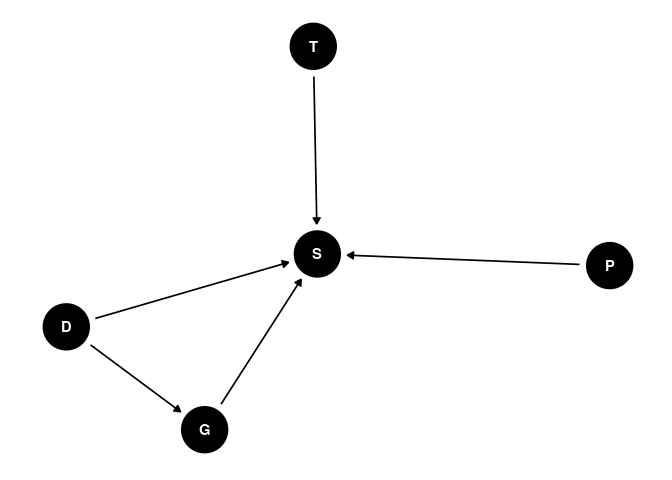

## Homework Week 6

**Question 1:** Conduct a prior predictive simulation for the Reedfrog
model. By this I mean to simulate the prior distribution of tank
survival probabilities αj. Start by using this prior:

Survival \~ Binomial(ni, pi)  
logit(pi) = αtank  
αj ∼ Normal( ̄α, σ)  
̄α ∼ Normal(0, 1)  
σ ∼ Exponential(1)

Be sure to transform the αj values to the probability scale for plotting
and summary. How does increasing the width of the prior on σ change the
prior distribution of αj? You might try Exponential(10) and
Exponential(0.1) for example.

Used code below to simulate the priors.

``` r
n <- 1e4
  
abar <- rnorm(n, 0, 1)
sigma <- rexp(n, 1)
  
rnorm(n, mean = abars, sd = sigmas)
```


As sigma is decreased to allow for more variation, more extreme values
(0,1) become more likely - decreasing the reliability of the prior. This
is the same outcome as in regular logit models.

NOTE: My plot doesn’t go to 0 like Richard’s solution because I used
brms function `inv_logit_scaled` instead of rethinking function
`inv_logit`… is there a non-scaled version for brms that doesn’t require
loading rethinking?

**Question 2:** Revisit the Reedfrog survival data, data(reedfrogs).
Start with the varying effects model from the book and lecture. Then
modify it to estimate the causal effects of the treatment variables pred
and size, including how size might modify the effect of predation. An
easy approach is to estimate an effect for each combination of pred and
size. Justify your model with a DAG of this experiment.

NOTE: Need help with the priors on this question but got to the
interaction effect with each level of predation and size using this brms
formula:

``` r
brm(bf(surv | trials(density) ~ 1 + (1 | predind*sizind) + (1 | tank)),
    prior = c(prior(normal(0, 1), class = Intercept),
               prior(exponential(1), class = sd)),
    family = binomial,
    data = frog_data,
    chains = 4,
    iter = 2000,
    cores = 4,
    save_model = NULL)
```

| X                                   |   Estimate | Est.Error |       Q2.5 |     Q97.5 |
|:------------------------------------|-----------:|----------:|-----------:|----------:|
| r\_predind:sizind\[1\_1,Intercept\] |  0.3192165 | 0.8020751 | -0.8651349 | 2.4062155 |
| r\_predind:sizind\[1\_2,Intercept\] |  0.5363877 | 0.8239596 | -0.5568038 | 2.7386810 |
| r\_predind:sizind\[2\_1,Intercept\] |  0.0987737 | 0.6265035 | -1.3889908 | 1.3777650 |
| r\_predind:sizind\[2\_2,Intercept\] | -0.4302259 | 0.6626777 | -2.1191880 | 0.5836853 |

We see a negative effect when there is high predation and large sizes,
which is interesting.

The DAG of this system/model can be visualized as:

<!-- -->

In Richard’s DAG he has them as all independent causal effects but I
think that in a tank (finite sized habitat), wouldn’t density affect
size? You can’t be 35 huge fish inside a tank? Unless the tank is
massive I guess…

**Question 3:** Now estimate the causal effect of density on survival.
Consider whether pred modifies the effect of density. There are several
good ways to include density in your Binomial GLM. You could treat it as
a continuous regression variable (possibly standardized). Or you could
convert it to an ordered category (with three levels). Compare the σ
(tank standard deviation) posterior distribution to σ from your model in
Problem 2. How are they different? Why?

**Question 4 (OPTIONAL):** Using your estimates from the previous
problems, compute the expected causal effect of removing predators from
a population of tadpoles with size and density distributed according to
this table:

| density | small | large |
|---------|-------|-------|
| 10      | 25%   | 25%   |
| 35      | 25%   | 25%   |

In other words, 25% of the population is in groups of 10 small tadpoles,
25% in groups of 10 large tadpoles, 25% in groups of 35 small tadpoles,
and 25% in groups of 25 large tadpoles. Think carefully about if and how
you should incorporate the tank varying effects in this calculation.
