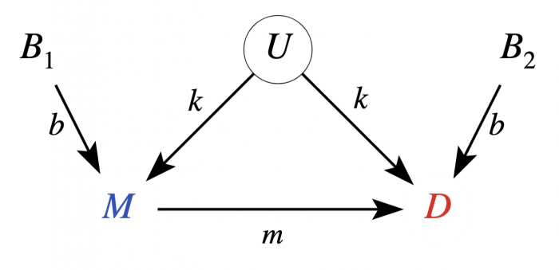
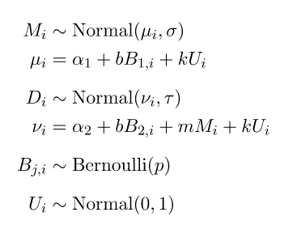
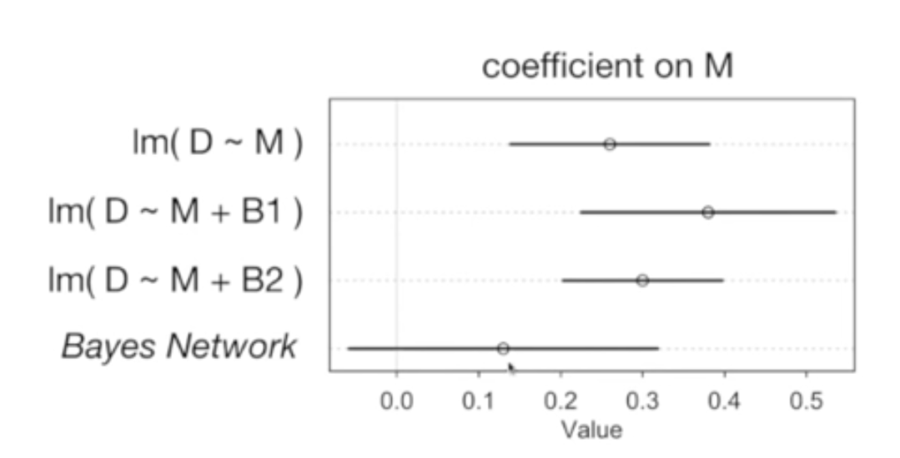

# Full Luxury Bayesian

1. Draw the causal model, using scientific knowledge of the system
2. Translate the causal model into a set of functions, where each node is a function of the nodes with arrows pointing into it
3. Translate these functions into probability distribution expressions with priors and expressions describing relationships of variables
4. Run the model, given your data
5. Run simulations based on the posterior to determine the implications of interventions

