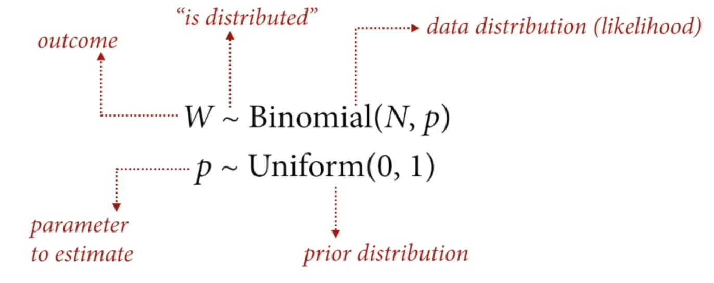

# Statistical Rethinking 2022 - Lecture 03

## Geocentric models

The geocentric model describes where the Earth is at the center, and Mars orbits around 
Earth's orbit. 

This is an example of prediction without explanation because it's an 
accurate approximation without understanding the true state or mechanism. 

The statistics analog, is a linear regression since it can be descriptively
accurate but mechanistically wrong. 

## Linear regression

Model of mean and variance of some variable

The mean as a weighted sum of other variables

## Normal distribution

The normal distribution is observed where there is a sum of fluctuations. 
There is a symmetric variation around the mean. The normal distribution 
is a maxent distribution. 

Note: a variable does not have to be distributed normally for the 
normal distribution to be appropriate. 

## Language for modeling

To compute these, we arrange them as probability statements. The pipe "|" means 
"is conditional on". 

## Scientific workflow

1. Question/goal/estimand
2. Scientific model
3. Statistical model
4. Validate the model
5. Analyze the data

### Example: adult height and weight

Describe the association between, for example, adult height and weight.
How does height influence weight?

If height influences weight

H -> W

then we can restructure this as a function

W = f(H)

The arrow from H to W indicates the consequences of an intervention. If you change 
the height of an individual (at birth), their weight will change, but the 
reverse is not true. 

The equation for a line

$y_{i} = a + \beta x_{i}$

is used in a linear regression to give a line with an expected value of y
for each value of x, an expectation. 

Sigma is a scale parameter, these types of parameters stretch a distribution
and are always positive. 

Variables can have part of their priors "built in", eg. when they have clear boundaries, like must be a positive number

Rescaling variables can help to pick priors because they are centered with a mean of 0

The joint posterior simultaneously considers all variables

## Validating models

Validating models: 

* simulation-based validation, taking the scientific model and simulating data from
it. Then, test the statistical model and see if it returns approximately 
the same values back
* even better, simulation-based calibration (TO READ)

## Statistical interpretation

* Parameters are not independent of one another
* Need to consider all variables using the posterior to interpret the results

For example,

1. Plot sample data
1. Plot the posterior mean
1. Plot uncertainty around the mean
1. Plot uncertainty around the predictions

## Misc

Log normal distributions are positive constrained and can be described as:
* normal distribution exponentiated
* (or) distribution that would be normal if you took the log

