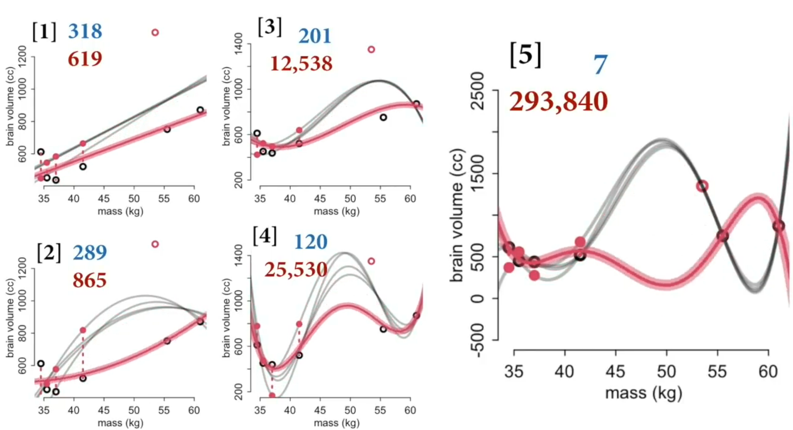

# Statistical Rethinking 2022 - Lecture 07

## Prediction

Parsing "prediction":

- What function describes the point? (fitting)
- What function explains the point? (causal inference)
- What would happen if we changed a point's variable X? (intervention, causal inference)
- What is the next observation from the same process? (prediction)

## Leave-one-out cross validation (LOO)

1. Drop one point
1. Fit line to remaining points
1. Predict the dropped point
1. Repeat with the next point
1. Score is the error on dropped points

In this example, think of each point as a posterior distribution.Bayesian cross validation uses the entire posterior, not just point prediction. 

Compare

