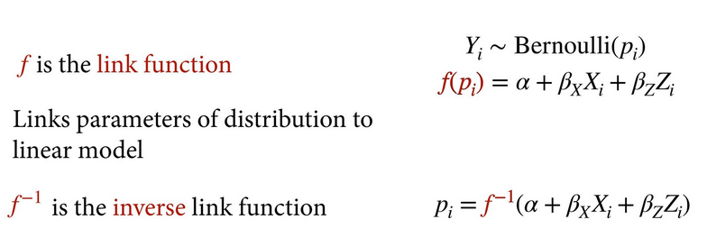
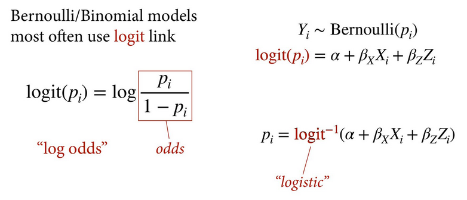
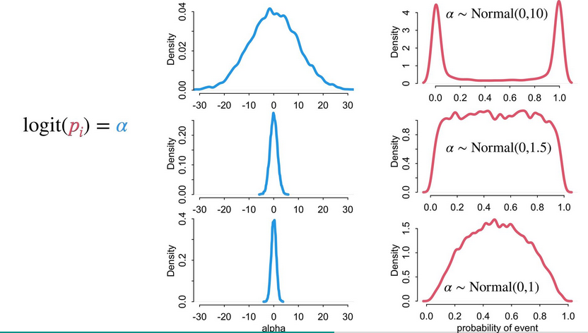

# Statistical Rethinking 2022 - Lecture 09

## Generalized linear models

Linear models: expected value is an additive ("linear") combination of
parameters. 

```
Yi ~ Normal(u, sigma)
u = a + Bx + By + ...
```

Generalized linear models: expected value is *some function* of an 
additive combination of parameters. 

```
Yi ~ Bernoulli(p)
f(p) = a + Bx + By + ...
```

Link functions map the probability  scale to the linear model scale. 



### Logit link

Bernoulli and binomial models often use the logit link. On the logit scale,
the approximate equivalences are -6 = never, 6 always and 0 half (p = 0.5).



Priors on logistics are typically narrow because too wide and the relevant
probability becomes bimodal either 0 or 1. At alpha ~ Normal(0, 1), the 
density of probability is more skeptical of extremes. 




### Example: UC Berkeley Admissions 1973

Evidence of gender discrimination?

Stratified by department and gender of applicant. 

DAG: 

Gender -> Department -> Admission

Gender -> Admission


What path represents discrimination?

Gender -> Admission is the direct discrimination, "status-based" or "taste-based" 
discrimination. 

Gender -> Department -> Admission is the indirect, structural discrimination. 

Statistical estimand: admission as a Bernoulli variable (0, 1). 
Total effect has an intercept for each gender and the direct effect
has an intercept for each gender in each department. 

Note: a Bernoulli variable (p) is equivalent for inference to a 
Binomial variable (N, p).

To compare, use the inverse logit then use contrasts. For two categories, 
just the difference between A and B, for more, compute pairwise contrasts. 


## Post-stratification

Post-stratification: re-weighting estimates for target population. Eg.
at a different university, the distribution of applications will differ
and the resulting predicted consequence of intervention will be different. 
