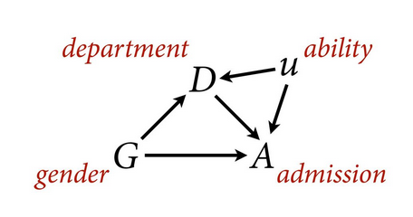
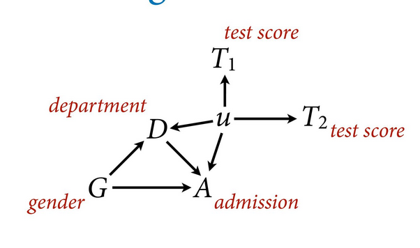
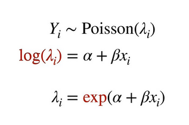
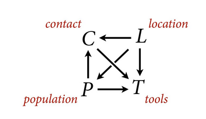
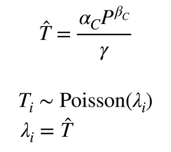
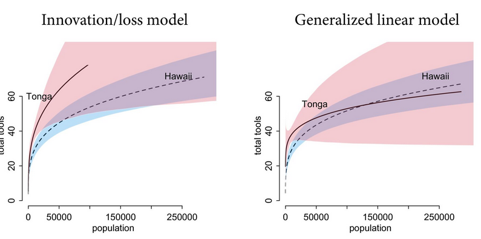

# Statistical Rethinking 2022 - Lecture 10

## De-confounding

What can be done?

- Experiments
- Sensitivity analysis
- Measure proxies of confound

## Sensitivity analysis

What are the implications of what we don't know?

Assume a confound exists and model its consequences for different 
strengths or kinds of influence. 

How strong must the confound be to change conclusions?

Vary confound strength over range and show how results change, or
vary other effects and estimate confound strength. 

### Example: UC Berkeley Admissions 1973

Ability is a confound that hides discrimination. Ability is a collider 
between department and admission. High ability compensates for discrimination,
masking the evidence. 

Measure proxies of the confound, eg. test scores to determine ability

## Poisson distribution

Characterized by a very high maximum and very low probability of each
success. The variable is the rate or expected count. It must be positive. 

Link is log. Inverse is exponential, caution with exponential 
scale for priors. 

### Example: oceanic tool complexity

How is technological complexity related to population size?

Estimand: causal influence of population size and contact on total tools

Tool count is poisson: very many possible technologies possible, very few 
realized in any one place.

Though the model largely characterizes the relationship, it does not
have a reasonable value at 0, the lines for contact/not cross for no
apparent reason and are heavily influenced by more extreme values. 

Solution: use a scientific model that better represents the relationships
between the variables

