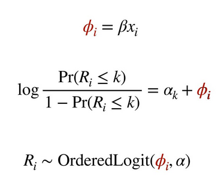
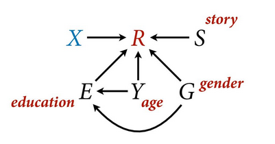
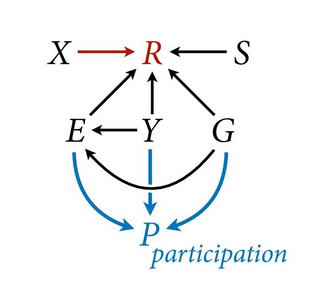
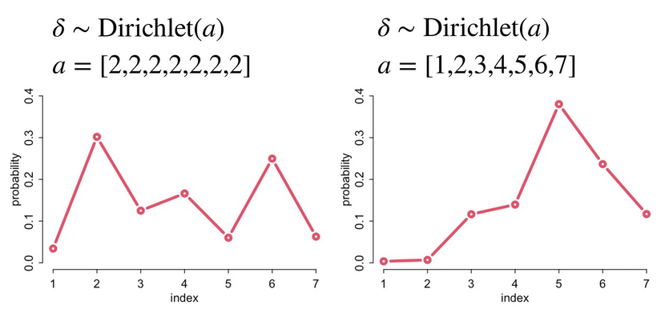

# Statistical Rethinking 2022 - Lecture 11

## Ordered categorical

Discrete types with ordered relationships, but ordering is not necessarily
linear, where the distance between values is not constant. Anchor points 
are common, though not necessarily shared across individuals. 

Eg. how appropriate (from 1-7)?

Ordered categories are transformed to cumulative distributions. Frequency ->
cumulative frequency -> cumulative log odds.  The highest category always 
has 1 cumulative proportion and infinity on the cumulative log odds scale. 
According to the model, the probability of eg. response = 3 is the 
difference between probability <= 3 and <= 2. 

Log odds values = cutpoints, and cutpoints become parameters on x. 

### Example: trolley problems

How morally permissible is it to pull the switch? 

Action/lack of action

Intention, where death is intended to save others

Contact, physical contact 

Caution: this is a voluntary sample. 

This is an example of endogenous selection. 
The sample is selected on a collider (P) and it induces misleading
associations among variables. 

## Ordered monotonic predictors

Predictor variables that are ordered but are not linearly separated. 

Coded using a simplex (a vector that sums to 1 = probability). 

Dirichlet distribution is a list of values where decreasing N value = increasing differences between categories. Eg. [10, 10, 10] will be more similar than [1, 2, 3]. 

