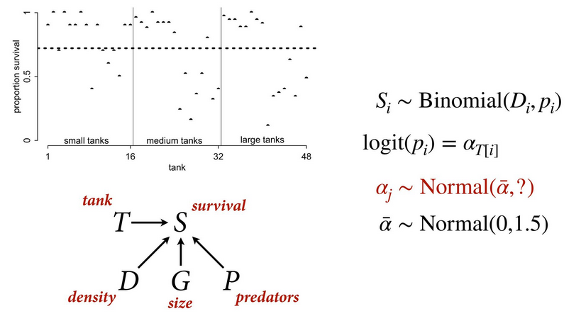

# Statistical Rethinking 2022 - Lecture 12

## Multilevel models

Multilevel models are models within models: 

1. Model observed groups/individuals
1. Model of population of groups/individuals

Memory = population model

Two perspectives on why we want models with memory:

1. They learn faster, better
1. They resist overfitting

### Example: coffee golem

Population of cafes, updated with each visit to each cafe. Individual
variable for wait time at cafe A and the population variable for 
wait time is updated after a visit to any cafe. Visits to cafe B inform
or revise the information about cafe B. 

## Regularization

Multilevel models use adaptive regularization. 

Complete pooling: treat all clusters as identical (global mean) = 
underfitting

No pooling: treat all clusters as unrelated = overfitting

Partial pooling: adaptive compromise

### Example: reedfrogs

48 groups of tadpoles, with varying density, size and predation. Outcome:
survival. 

Survival is distributed binomially with a maximum at the density of each 
tank, with probability of survival p. There's an average survival rate 
across all tanks, which we want to model. But the challenge is determining
what the sd we should assign. If we use a very constricted sd (eg. 0.1) 
we are limiting the potential difference from the mean for each tank. 
If we use a large sd (eg. 5), each tank will be much closer to the actual 
sampled value. 

One option for determining the appropriate sd for this question
specifically is to use PSIS. The lowest (good) PSIS values
plateau around sd = 1.2, where fitting is worse for extreme values
but predictions are better. This approach could work, but 
requires running multiple versions of the model across a range of 
sd values. 

Solution is to model sigma as a parameter in the model, a hyperprior. 
We can use an Exponential(1) where the highest density is near 0, with
decreasing density as it increases. The multilevel model itself then 
identifies the appropriate sigma to use, which ends up being the same 
as PSIS identified. 

The result from this multilevel model shows wider compatibility intervals
and more skepticism for groups with fewer data points than those 
with more points. Extreme values are also treated skeptically. 

### Superstitions

1. Clusters do not need to be sampled at random

1. The number of clusters do not need to large

1. Just because the priors are Gaussian does not mean the posterior 
distribution has to be Gaussian

