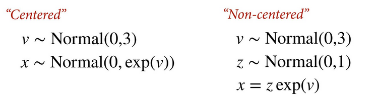

# Statistical Rethinking 2022 - Lecture 13

## Clusters and features

Clusters: kinds of groups in the data

Features: aspects that vary by cluster

Eg. (clusters -> features)

- tanks -> survival
- stories -> treatment effect
- individuals -> response
- departments -> admission rate

To add clusters: include index variables, population priors

To add features: include more parameters, more dimensions in each population
prior

### Example: prosocial chimpanzees

504 trials, 7 actors, 6 blocks, 4 treatments. Response is pulled the left 
lever, which is variably the prosocial option with/without a partner.

In this case, we are pooling across treatments. Why? Treatments are not 
completely different, there are many possible treatments and we only used
a subset, and helps get better estimates. If multiple parameters get the 
same prior, it's usually better to learn the prior from the sample. 

Warning: variance does not add. In a linear model, variance components 
are additive where the total variation in the outcome is the sum 
of the components. This is not true for generalized linear models 
because the link function breaks additivity. Variation in one component
instead moderates the variation in the others. 

## Multilevel predictions

1. Predict for the same groups using the varying effect estimates 
for each group
1. Predict for new groups ignoring the varying effect estimates and 
marginalizing over the population distribution (sigmas)

### Multilevel predictions: new groups

Reedfrogs: target population with 50% predation, 25% large tadpoles. What is
the causal effect of increasing the size to 75% large?

Extract the posterior samples, simulate survival for 25% and 75%, then
compute the contrast. 

## Reparameterize

Hamiltonian Monte Carlo shouldn't often have any divergent transitions
and divergent transitions are a symptom of inefficient sampling. 
Varying effects distributions are conditional on other distributions. 
This often results in high curvature, where the simulation cannot
easily follow the surface. 

Solutions: 

1. Decrease the step size, though exploration will be slow
2. Reparameterize the model

Reparameterizing the model from the centered version to the non-centered 
version. This involves removing the prior distribution that is dependent
on another prior distribution, in favor for a z score distribution, 
standardized normal, and calculating the relationship separately. The 
z score version gets a standardized normal (Normal(0, 1)). In `brms`,
this non-centered version is the default, built in behaviour. This
non-centered parameterization yields a distribution that is much 
easier to sample.

For example, the reedfrogs model:

