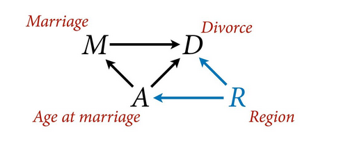
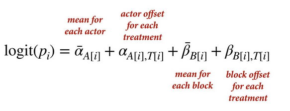
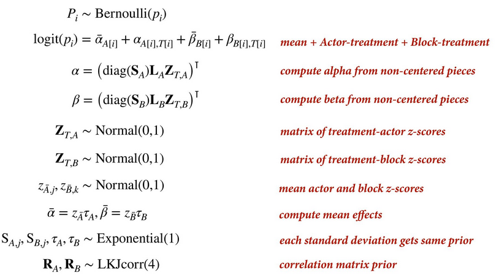

# Statistical Rethinking 2022 - Lecture 14

## Varying effects as confounds

Unmeasured features of clusters leave an imprint on the data 
that can be measured using repeat observations of each cluster and 
partial pooling among clusters. This results in better predictions
and can be used to manage confounds or competing causes.

## Adding features - multivariate normal

There is one prior distribution for each cluster. Within each, 
you can have 1-N features and an associated 1-N dimension distribution. 

1 feature = 1 dimensional distribution

2 features = 2 dimensional distribution

N features = N dimensional distribution

The distribution used for 1-N dimensions is the multivariate normal 
(MVNormal). Multiple normal distributions joined together with 
some covariance across dimensions. The parameters include a list
of means and a covariance matrix.

This approach estimates each parameter separately and does partial pooling,
it also estimates the correlation between them. 

### Example: prosocial chimpanzees

In the case of treatment, there are four means and a correlation 
matrix of actors within treatment, and a standard deviation for each. 

Correlation matrices have priors too, here the LKJcorr(4), a distribution
for correlation matrices. 